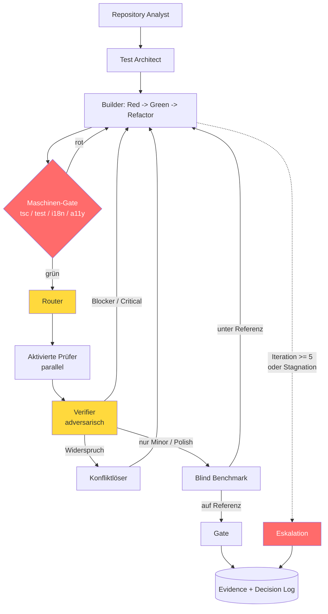

# FinTracker AAA+ — Agenten-Graph statt Gauntlet-Loop

> Ersetzt die festen Ketten aus [§10 „Gauntlet Loops"](implementation-plan.md#10-gauntlet-loops)
> durch einen gerichteten Graphen mit bedingten Kanten und einem Router, der
> **je Artefakt** entscheidet, welcher Agent und welche Modellstufe zum Einsatz
> kommt.
>
> Ausführbare Fassung: [`.claude/workflows/aaa-graph-orchestrator.mjs`](../../.claude/workflows/aaa-graph-orchestrator.mjs).

## 1. Was der Gauntlet Loop ist — und wo er hier bricht

Matt Shumers Gauntlet Loop (bekannt geworden durch *Claude of Duty*) ist ein
reiner Prompt, kein Harness. Er besteht aus drei Absätzen, die drei Dinge
anordnen:

1. **Fan-out** — Sub-Agenten bearbeiten Qualitätsbereiche einzeln.
2. **Harter, getrennter Critic** — ein eigener Sub-Agent prüft und schickt
   zurück, solange die Stufe (`AAA`) nicht erreicht ist.
3. **Blinder A/B-Vergleich** gegen eine reale Referenz — „compare them side by
   side blind and say which one looks better".

Die Referenz-Implementierung schreibt ausdrücklich vor, das Verfahren **nicht**
zu umbauen: keine Helper-Skripte, keine State-Machine, keine Stop-Regeln. Die
Begründung ist konsistent: *„The human is the brake. The bar stays unreachable.
Quality is a function of runtime."*

Für ein Demo-Spiel mit einem Menschen davor ist das richtig. Für dieses
Programm ist es aus fünf Gründen falsch:

| Annahme des Loops | Lage bei FinTracker |
|---|---|
| Eine Qualitätsachse („sieht es besser aus") | Zehn gewichtete Kategorien, **vier davon nicht kompensierbar** (Plan §11) |
| Kein Abbruch, Mensch ist die Bremse | Unbeaufsichtigter Lauf über 30+ Arbeitspakete — eine Endlosschleife auf WP-5.1 heißt, Phase 6 startet nie |
| Fester Critic für jedes Artefakt | Ein CSS-Token-WP braucht keinen Data-Viz-Critic; ein Sankey-WP braucht ihn zwingend |
| Critic urteilt durch Hinsehen | Bei Finanzsoftware ist die *unsichtbare* Achse die wichtigste: Cent-Arithmetik, Aggregation, i18n-Parität |
| Naives Fan-out auf ein Artefakt | Plan §8 nennt Dateien, die **nie** parallel angefasst werden dürfen (`index.css`, `AppShell.tsx`, `skins.ts`, `tailwind.config.js`) |

Der harte Punkt ist der zweite. „Es endet nicht von selbst" ist beim Loop kein
Nebeneffekt, sondern das erklärte Ziel. Genau das macht ihn als unbeaufsichtigten
Orchestrator unbrauchbar — nicht, weil er schlecht wäre, sondern weil er für
einen anderen Betriebsmodus gebaut ist.

**Was bleibt:** Die drei Ideen des Loops sind gut und werden übernommen —
getrennter Critic-Kontext, echte Referenz, Rückschleife statt Freigabe. Ersetzt
wird nur die *Topologie*: feste Kette → Graph.

## 2. Das Graph-Modell

### 2.1 Knotentypen

| Typ | Knoten | Erzeugt |
|---|---|---|
| **Quelle** | Repository Analyst, Test Architect, Builder | Artefakte (Audit, Spec, Code) |
| **Prüfer** | Art Director, UX Critic, Motion Director, Data-Viz Critic, A11y Critic, Performance Critic, Regression Critic, Product Architect | Befunde mit Schweregrad |
| **Blind** | Blind Benchmark Critic | Vergleichsurteil gegen Referenz |
| **Steuerung** | Router, Verifier, Gate, Konfliktlöser, Eskalation | Routing-Entscheidungen |

Die Rollen und ihre Kontextgrenzen stammen unverändert aus Plan §9. Neu sind
ausschließlich die vier Steuerungsknoten.

### 2.2 Der Router — Kern des Ganzen

Statt „WP-Typ → feste Kette" berechnet der Router die Prüfermenge aus dem
tatsächlichen Artefakt (Diff, berührte Dateien, WP-Metadaten).

Er arbeitet **zweistufig**, und diese Trennung ist die zentrale
Sicherheitseigenschaft:

```
Pflichtmenge  := deterministisch aus Trigger-Matrix (Dateiglobs, WP-Typ)
Zusatzmenge   := modellgestützter Vorschlag
Aktivierung   := Pflichtmenge ∪ Zusatzmenge
```

> **Deterministischer Boden, modellgetriebene Decke.** Das Modell darf Prüfer
> *hinzufügen*, niemals einen Pflicht-Prüfer entfernen.

Ohne diese Asymmetrie tritt der bekannteste Routing-Fehler ein: Ein Modell,
das Effizienz optimieren soll, routet am teuren Critic vorbei und meldet
Erfolg. Die Trigger-Matrix macht das unmöglich.

Auszug der Trigger-Matrix (vollständig im Skript):

| Prüfer | Pflicht, wenn Diff berührt … |
|---|---|
| A11y Critic | **immer** (nicht kompensierbar, Plan §11) |
| Regression Critic | **immer** |
| Motion Director | `motion-tokens`, `framer-motion`, `@keyframes`, `transition`, `useChartAnimation` |
| Data-Viz Critic | `recharts`, `charts/**`, `Sankey`, `src/lib/analysis-data` |
| Performance Critic | `finance-city/**`, `three`, `canvas`, `WebGL` |
| Art Director | `index.css`, `skins*`, `tailwind.config.js`, `material-tokens` |
| Product Architect | `src/services/**`, `src/lib/money*`, Datenmodell |

### 2.3 Kanten sind bedingt, nicht sequenziell



Drei Kanten verdienen Erklärung:

- **`M` vor `R`:** Kein Critic-Token wird ausgegeben, solange `tsc`, `pnpm test`
  und `check:i18n` rot sind. Maschinelle Wahrheit ist billiger als jedes
  Modellurteil und schlägt es im Zweifel.
- **`V` nach `C`:** Befunde gehen nicht direkt zum Builder. Erst prüft ein
  unabhängiger Verifier, ob der Befund reproduzierbar ist (siehe §3.4).
- **`B` → `E` gestrichelt:** Eskalation ist ein *Ergebnis*, kein Fehler. Sie
  endet mit einem dokumentierten offenen Punkt, nicht mit stillem Bestehen.

## 3. Die acht Optimierungen gegenüber dem reinen Loop

### 3.1 Prüferauswahl je Artefakt statt fester Kette

Plan §10 kennt fünf Spezial-Loops (Design-System, Screen, Stadt, Motion,
Diagramm). Ein WP fällt aber selten sauber in genau einen: WP-6.7
(Chart-Animation) ist Diagramm **und** Motion. Der Graph aktiviert beide
Prüfer, ohne dass jemand vorher eine sechste Kette definieren muss.

### 3.2 Beschränkte Terminierung mit expliziter Eskalation

Der Loop endet nie. Der Graph endet in genau drei Zuständen:

| Endzustand | Bedingung |
|---|---|
| `bestanden` | Maschinen-Gate grün, keine offenen Blocker/Critical/Major, Blind Benchmark auf Referenzniveau |
| `eskaliert` | 5 Iterationen erreicht **oder** Stagnation (2 Runden ohne behobenen/neuen Major+) |
| `abgebrochen` | Nicht kompensierbares Kriterium nachweislich unerreichbar |

Plan §10 fordert das bereits („Loop-Schutz"). Im Graphen ist es eine Kante,
keine Ermahnung in einem Prompt.

**Stagnation ist die eigentliche Gefahr,** nicht die Iterationszahl. Zwei
Runden, in denen sich die Befundmenge nicht verändert, bedeuten: Der Builder
versteht die Kritik nicht oder die Kritik ist nicht umsetzbar. Weitere Runden
verbrennen nur Kontext.

### 3.3 Fail-fast auf Schweregrad

Der Loop lässt alle Critics laufen und aggregiert. Findet der erste Prüfer
einen Blocker, ist die Kritik aller übrigen **veraltet** — der Code ändert sich
ohnehin. Der Graph bricht die Prüferrunde ab und springt zurück zum Builder.
Spart Modellaufrufe und verhindert, dass der Builder gleichzeitig zehn
teilweise widersprüchliche Punkte abarbeitet.

### 3.4 Evidenz-Gate für Befunde (wichtigster Hebel)

> Ein Befund, der nicht reproduzierbar ist, wird auf `Polish` herabgestuft und
> blockiert nichts.

Reproduzierbar heißt: fehlschlagender Test, axe-Regel-ID, `tsc`-Fehler,
gemessener Wert, oder Datei + Zeile mit konkret falscher Aussage.

Das ist der Unterschied zwischen einem Loop, der konvergiert, und einem, der
ewig läuft. Ein Modell, das aufgefordert wird, „wirklich harsch" zu sein,
produziert zuverlässig plausibel klingende, aber nicht belegbare Kritik
(„die Hierarchie wirkt noch nicht ganz stimmig"). Jeder solche Befund kostet
eine volle Builder-Runde und behebt nichts. Der Verifier-Knoten ist ein
unabhängiger Agent mit dem Auftrag, den Befund zu **widerlegen** — nicht zu
bestätigen.

### 3.5 Blindheit als Grapheigenschaft, nicht als Bitte

Im Loop steht „Du erhältst NICHT: interne Begründungen des Builders" im Prompt.
Im Graphen **trägt die Kante diese Information schlicht nicht**: Der Input des
Blind-Benchmark-Knotens wird aus Ziel + Artefakt + Rubrik + Referenz
zusammengesetzt. Der Builder-Kontext ist physisch nicht erreichbar, weil
Sub-Agenten in eigenen Kontextfenstern laufen.

### 3.6 Nicht kompensierbare Kriterien sind Kanten, keine Gewichte

Plan §11 gewichtet zehn Kategorien und fordert 3.5 im Mittel. Ein gewichteter
Mittelwert lässt aber eine 5 in „Art Direction" eine 2 in „Accessibility"
verdecken. Im Graphen führt `A11y < 4` **unabhängig vom Gesamtwert** zur
Rework-Kante. Gewichte entscheiden nur noch zwischen „bestanden" und „bestanden
mit Polish-Rest".

### 3.7 Dateisperren-bewusste Planung

Aus Plan §8: `src/index.css`, `src/skins/skins.ts`, `AppShell.tsx`,
`tailwind.config.js` dürfen nie parallel bearbeitet werden. Der Scheduler
serialisiert WPs, deren Dateimengen sich mit dieser Liste schneiden, und lässt
disjunkte WPs echt parallel laufen. Naives Fan-out würde hier zuverlässig
Änderungen überschreiben.

### 3.8 Kostenbewusstes Modell-Routing

Das Modell ist Teil der Routing-Entscheidung, nicht global gesetzt.

| Stufe | Knoten | Begründung |
|---|---|---|
| **Haiku** | Doku-Gerüste, mechanische Sweeps, Dateiinventar | Musteranwendung ohne Entwurfsentscheidung |
| **Sonnet** | Repository Analyst, Builder, die meisten Prüfer, Verifier | Standardarbeit mit klarer Spezifikation |
| **Opus** | Test Architect (komplexe WPs), Blind Benchmark, Konfliktlöser, Eskalation, Gate | Urteil unter Zielkonflikt; Fehler hier pflanzen sich in alle Folgeknoten fort |

Die Regel dahinter: **Modellstärke dort, wo ein Fehler nicht durch einen
späteren Knoten gefangen wird.** Ein schwacher Builder wird vom Maschinen-Gate
und den Prüfern korrigiert. Ein schwacher Test Architect spezifiziert das
falsche Verhalten — und alles danach implementiert und bestätigt den Fehler
korrekt. Deshalb steht dort Opus und nicht beim Builder.

Eskalationsregel: Findet ein Sonnet-Prüfer einen Blocker, verifiziert ihn ein
Opus-Verifier. Falsch-positive Blocker sind teurer als der Modellaufruf.

## 4. Verhältnis zum bestehenden Plan

Der Graph **ersetzt** Plan §10 (Loop-Topologie) und **präzisiert** §11
(Gewichte → Kanten). Unverändert gültig bleiben:

- §9 Rollen, Kontextgrenzen, Konfliktprioritäten
  (A11y > Performance > Funktionalität > Art Direction > Motion)
- §12 Teststrategie, §15 Definition of Done
- §16 Ablageorte, Fortschritts- und Commit-Regeln

## 5. Was der Graph nicht kann

- **Er ersetzt kein menschliches Geschmacksurteil.** Der Blind-Benchmark-Knoten
  vergleicht gegen eine beschriebene Referenz, nicht gegen einen echten
  Screenshot von Linear oder Copilot Money. Er erkennt „inkonsistent" und
  „amateurhaft" zuverlässig, „schön" nicht.
- **Er misst nicht, was nicht läuft.** Performance- und A11y-Urteile sind nur
  so gut wie die E2E-Läufe darunter (`e2e-tests/`).
- **Er kann eine falsche Referenz nicht bemerken.** Ist die Referenz für den
  Zweck ungeeignet, konvergiert der Graph sauber gegen das falsche Ziel. Das
  bleibt eine Orchestrator-Entscheidung.
