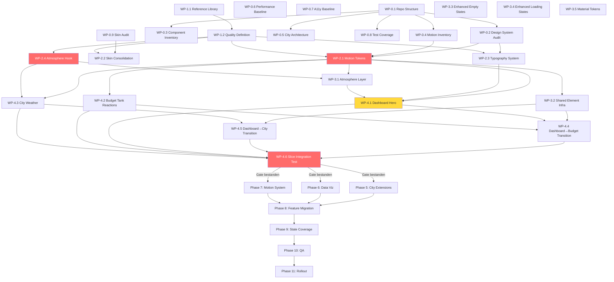

# FinTracker AAA+ — Operative Implementierungsspezifikation

> Dieses Dokument ist keine Sammlung von Ideen. Es ist die ausführbare
> Spezifikation für ein agentisches Entwicklungsprogramm, das FinTracker
> kontrolliert, nachvollziehbar und iterativ auf AAA+-Niveau weiterentwickelt.
>
> Jedes Arbeitspaket ist so präzise formuliert, dass ein Builder-Agent es ohne
> eigene Produktentscheidungen ausführen kann und ein unabhängiger Critic-Agent
> es reproduzierbar bewerten kann.

---

## Inhaltsverzeichnis

1. [Executive Implementation Summary](#1-executive-implementation-summary)
2. [Verifizierter und noch zu prüfender Ist-Zustand](#2-verifizierter-und-noch-zu-prüfender-ist-zustand)
3. [Zielarchitektur des Erlebnisses](#3-zielarchitektur-des-erlebnisses)
4. [Programmphasen](#4-programmphasen)
5. [Vertical Slice](#5-vertical-slice)
6. [Detaillierter Backlog](#6-detaillierter-backlog)
7. [Vollständige Spezifikation der ersten Arbeitspakete](#7-vollständige-spezifikation-der-ersten-arbeitspakete)
8. [Dependency Graph](#8-dependency-graph)
9. [Agentenorganisation](#9-agentenorganisation)
10. [Gauntlet Loops](#10-gauntlet-loops)
11. [Qualitätsmatrix](#11-qualitätsmatrix)
12. [Teststrategie](#12-teststrategie)
13. [Rolloutstrategie](#13-rolloutstrategie)
14. [Risiken und Gegenmaßnahmen](#14-risiken-und-gegenmaßnahmen)
15. [Definition of Done](#15-definition-of-done)
16. [Startpaket für die Ausführung](#16-startpaket-für-die-ausführung)

---

<a id="1-executive-implementation-summary"></a>
## 1. Executive Implementation Summary

### Zielbild

FinTracker transformiert sich von einer Feature-reichen, kompetent gestalteten
Anwendung zu einem kohärenten, hochwertigen und unverwechselbaren Finanzprodukt
mit AAA+-Charakter. Die Transformation betrifft nicht primär neue Features,
sondern Art Direction, visuelle Hierarchie, Motion Design, Datenvisualisierung
und die funktionale Integration der Finanzstadt.

### Strategie

1. **Vertical Slice zuerst** — Ein zusammenhängender Bereich (Dashboard → Stadt
   → Budget-Detail) wird als erstes vollständig auf Zielniveau gebracht, bevor
   die Anwendung migriert wird. Das validiert Konzept, Technik und Prozess.

2. **TDD durchgängig** — Jedes testbare Arbeitspaket folgt dem verbindlichen
   Red-Green-Refactor-Zyklus. Verhalten wird spezifiziert, bevor Code geschrieben wird.

3. **Gauntlet Loop** — Jedes Arbeitspaket durchläuft einen Builder → Critic →
   Blind-Benchmark-Zyklus mit definierten Qualitätsgates und Beweispflicht.

4. **Progressive Integration** — Änderungen werden hinter Feature Flags aktiviert,
   parallele alte/newe Ansichten sind möglich, Rollback ist jederzeit verfügbar.

### Reihenfolge

```
Phase 0 (Audit) → Phase 1 (Referenzen) → Phase 2 (Art Direction)
→ Phase 3 (Design System) → Phase 4 (Vertical Slice)
→ Phase 5 (Stadt) | Phase 6 (Data Viz) | Phase 7 (Motion)  [parallel]
→ Phase 8 (Feature Migration) → Phase 9 (State Coverage)
→ Phase 10 (QA) → Phase 11 (Rollout)
```

### Zentrale Risiken

| Risiko | Wahrscheinlichkeit | Auswirkung | Gegenmaßnahme |
|---|---|---|---|
| Performance-Regression durch atmosphärische Layer | Hoch | Hoch | Performance-Budget, DPR-Kaskade, Fallback-Stufen |
| Skin-Konsolidierung verärgert Bestandsnutzer | Mittel | Mittel | Inaktive Skins bleiben funktional, Hinweis-UI |
| Shared-Element-Transitions fragmentieren auf Mobile | Mittel | Hoch | Vertical-Slice-Validierung auf Mobile zuerst |
| Visual Regression-Tests zu instabil | Hoch | Mittel | Deterministische Testdaten, feste Viewports, Toleranz-Banding |
| Agenten-Loops produzieren inkonsistente Ergebnisse | Mittel | Hoch | Strikte Trennung Builder/Critic, Blind-Benchmark |

---

<a id="2-verifizierter-und-noch-zu-prüfender-ist-zustand"></a>
## 2. Verifizierter und noch zu prüfender Ist-Zustand

### Verifizierte Fakten (Codebase geprüft)

| Bereich | Verifizierter Zustand | Quelle |
|---|---|---|
| **Framework** | React 18 + TypeScript strict, Vite 8 | `package.json`, `tsconfig.json` |
| **Styling** | Tailwind CSS 4 (`@tailwindcss/postcss`), kein Custom-CSS außer `skins.css`/`skins-components.css` | `postcss.config.js`, `src/index.css` |
| **UI-Komponenten** | shadcn/ui (`@/components/ui/`), Radix UI primitives | `src/components/ui/` |
| **Charts** | Recharts ^3.10.0, immer in `ResponsiveContainer` | `package.json`, AGENTS.md §7 |
| **3D** | three.js ^0.185.1, ausschließlich in `src/features/finance-city/` | AGENTS.md §7 |
| **Animation** | Framer Motion ^12.42.2, CSS, `requestAnimationFrame` | `package.json`, `src/hooks/useAnimatedNumber.ts` |
| **State** | TanStack Query ^5.101.2, kein Redux/Zustand | `package.json`, AGENTS.md §7 |
| **Storage** | IndexedDB (local-first), AES-GCM optional, Supabase nur für Auth/opt-in | AGENTS.md §1 |
| **Paketmanager** | pnpm 10.12.4 / Node 22 | AGENTS.md §2 |
| **Testing** | Vitest 4, Testing Library, fake-indexeddb, jsdom | `package.json`, `vitest.config.ts` |
| **i18n** | 3 Sprachen (de, en, ru) + everyday/technical Worting-Overlays | `src/i18n/translations.ts` |
| **Skins** | 9 Skins: ruhe, legacy, clean, neon, imperium, sakura, iron-man, cyberpunk, liquid-holo | `src/skins/skins.ts` |
| **Design Tokens** | HSL-Variablen in `:root`/`.dark`, semantische Akzente (brand, premium, positive, warning), 5-stufige Status-Skala | `src/index.css` |
| **Typografie** | Inter Variable (sans), Space Grotesk Variable (display), `tabular-nums` global | `src/index.css`, `tailwind.config.js` |
| **Reduced Motion** | Globale `@media (prefers-reduced-motion: reduce)` in CSS + `useReducedMotion`-Hook | `src/index.css`, `src/hooks/useReducedMotion.ts` |
| **Finanzstadt** | Domain/Application/Presentation-Architektur, Render-on-Demand, DPR-Cap, HTML-Labels, Kontaktschatten, prozedurale Texturen, ACES-Tone-Mapping | `src/features/finance-city/` |
| **BudgetTank** | SVG mit Wellen, Schwellenfarben (`colorForFill`), Füll-Animation, Glanzlicht | `src/components/budgets/BudgetTank.tsx` |
| **Motion-Token** | **Nicht vorhanden** — Easing-Kurven und Dauern sind über ≥5 Dateien verstreut | Codebase-Analyse |
| **Atmosphäre-System** | **Nicht vorhanden** | Codebase-Analyse |
| **Shared-Element-Transitions** | **Nicht vorhanden** — Navigation ist Router-Austausch | Codebase-Analyse |
| **E2E-Tests** | Playwright-Konfiguration vorhanden (`e2e-tests/`) | `e2e-tests/` Ordner |

### Wahrscheinlicher Ist-Zustand (nicht im Detail geprüft)

| Bereich | Wahrscheinlicher Zustand | Zu prüfen durch |
|---|---|---|
| KPICard-Größen | `text-lg` bis `text-2xl`, nicht Hero-Größe | Repository Analyst (WP-0.3) |
| Chart-Aufbau-Animationen | Recharts-Default-Animation aktiv, aber nicht systematisch konfiguriert | Repository Analyst (WP-0.4) |
| Ladezustände | `Skeleton`-Komponente vorhanden, aber nicht alle Screens nutzen sie | Repository Analyst (WP-0.8) |
| Tastatur-Navigation | Radix primitives sind zugänglich, aber Fokus-Sichtbarkeit variiert | Accessibility Critic (WP-0.7) |
| Performance | Stadt hat Render-on-Demand, aber allgemeine App-Performance nicht gemessen | Performance Critic (WP-0.6) |

### Noch zu prüfende Fragen

| Frage | Zuständiger Agent | Ergebnisdokument | Blockiert |
|---|---|---|---|
| Welche Komponenten existieren mit welchen Props/Varianten? | Repository Analyst | Component Inventory | Phase 3+ |
| Welche Screens haben welche Lade-/Leer-/Fehlerzustände? | Repository Analyst | State Coverage Matrix | Phase 9+ |
| Welche Charts verwenden `isAnimationActive={false}`? | Repository Analyst | Motion Inventory | WP-2.1 |
| Wie hoch ist die aktuelle Initial Load Zeit? | Performance Critic | Performance Baseline | WP-0.6 |
| Welche E2E-Tests existieren und decken welche Pfade ab? | Repository Analyst | E2E Test Inventory | Phase 10 |
| Wieviele Komponenten haben hardcodierte Pixelgrößen? | Repository Analyst | Typography Audit | WP-2.3 |

---

<a id="3-zielarchitektur-des-erlebnisses"></a>
## 3. Zielarchitektur des Erlebnisses

### Drei-Ebenen-Modell

```
┌─────────────────────────────────────────────────────────┐
│  Ebene 1: Atmosphäre (datengesteuert, CSS-basiert)       │
│  ┌───────────────────────────────────────────────────┐  │
│  │  AtmosphereLayer (fixed, pointer-events:none)      │  │
│  │  Temperatur/Intensität aus useAtmosphereState()    │  │
│  └───────────────────────────────────────────────────┘  │
├─────────────────────────────────────────────────────────┤
│  Ebene 2: Produktoberfläche (präzise, dirigiert)         │
│  ┌──────────────┐  ┌──────────────┐  ┌──────────────┐  │
│  │  Dashboard    │  │  Budgets     │  │  Transaktionen│  │
│  │  (Hero-Hier.) │  │  (Tank-React)│  │  (Flow-List) │  │
│  └──────┬───────┘  └──────┬───────┘  └──────┬───────┘  │
│         │   Shared-Element-Transitions      │            │
│         └──────────┬──────────┘             │            │
│                    ▼                        ▼            │
├─────────────────────────────────────────────────────────┤
│  Ebene 3: Finanzstadt (räumlich, datengetrieben)          │
│  ┌───────────────────────────────────────────────────┐  │
│  │  CityCanvas (three.js, Render-on-Demand)            │  │
│  │  + Wetter-Logik (Atmosphere Preset)                │  │
│  │  + Flusslinien (WP-5.x)                           │  │
│  │  + Zeitachse (WP-5.x)                             │  │
│  └───────────────────────────────────────────────────┘  │
└─────────────────────────────────────────────────────────┘
```

### Verbindung der Ebenen

- **Atmosphäre → Oberfläche:** `useAtmosphereState()` liefert einen Zustand, der
  sowohl `AtmosphereLayer` (Hintergrund) als auch die Stadt (Wetter-Preset) speist.
- **Oberfläche → Stadt:** Tippen auf ein Dashboard-Element mit Stadt-Bezug
  navigiert zur Stadt mit fokussiertem Gebäude (Shared-Element-Transition).
- **Stadt → Oberfläche:** Tippen auf ein Gebäude öffnet die Detailansicht
  (Overlay-Fade mit `layoutId`-Bezug).

### Fallback-Hierarchie

```
Vollmodus (Desktop, starke GPU)
├─ AtmosphereLayer (animiert)
├─ Shared-Element-Transitions
├─ City-Wetter-Logik
└─ Signature Moments

Reduzierter Modus (Mobile, schwache GPU ODER Reduced Motion)
├─ AtmosphereLayer (statisch)
├─ Direkte Navigation (keine Shared Transitions)
├─ City ohne Wetter (Standard-Preset)
└─ Signature Moments (vereinfacht)

Minimalmodus (kein WebGL)
├─ AtmosphereLayer (CSS-only)
├─ Standard-Navigation
├─ CityAccessibleList (Listenansicht statt 3D)
└─ Signature Moments (CSS-only)
```

---

<a id="4-programmphasen"></a>
## 4. Programmphasen

### Phase 0: Bestandsaufnahme

**Ziel:** Vollständiges, verifiziertes Bild des Ist-Zustands. Keine Annahmen.

**Arbeitspakete:** WP-0.1 bis WP-0.9 (Audit, keine Implementierung).

**Abhängigkeiten:** Keine — Phase 0 kann sofort beginnen.

**Exit-Kriterium:** Alle Audit-Dokumente liegen vor, sind vom Orchestrator
geprüft und im `docs/aaa-plus/audits/` abgelegt.

| WP-ID | Titel | Agent | Ergebnis |
|---|---|---|---|
| WP-0.1 | Repository Structure Audit | Repository Analyst | `repo-structure.md` |
| WP-0.2 | Design System & Token Audit | Repository Analyst | `design-system-audit.md` |
| WP-0.3 | Component Inventory & Baseline Screenshots | Repository Analyst | `component-inventory.md` + Screenshots |
| WP-0.4 | Motion & Animation Inventory | Repository Analyst | `motion-inventory.md` |
| WP-0.5 | Finance City Architecture Audit | Repository Analyst | `city-architecture-audit.md` |
| WP-0.6 | Performance Baseline | Performance Critic | `performance-baseline.md` |
| WP-0.7 | Accessibility Baseline | Accessibility Critic | `a11y-baseline.md` |
| WP-0.8 | Test Coverage & State Matrix | Repository Analyst | `test-coverage.md` + `state-matrix.md` |
| WP-0.9 | Skin Audit & Consolidation Analysis | Repository Analyst | `skin-audit.md` |

### Phase 1: Referenzrahmen

**Ziel:** Konkrete externe Referenzen und interne Qualitätsdefinition.

| WP-ID | Titel | Agent | Ergebnis |
|---|---|---|---|
| WP-1.1 | Reference Benchmark Library | Art Director | `reference-library.md` |
| WP-1.2 | AAA+ Quality Definition | Product Architect | `quality-definition.md` |

**Abhängigkeiten:** Phase 0 abgeschlossen.

### Phase 2: Visuelle Art Direction

**Ziel:** Kanonische visuelle Identität, Motion-Token, Typografie-System,
Skin-Konsolidierung.

| WP-ID | Titel | Agent | TDD |
|---|---|---|---|
| WP-2.1 | Motion Token System | Builder | Ja — siehe `tdd-specs.md` |
| WP-2.2 | Skin-Konsolidierung | Builder | Ja |
| WP-2.3 | Typografie-Hierarchie-System | Builder | Ja |
| WP-2.4 | Atmosphere State Hook | Builder | Ja |

**Abhängigkeiten:** Phase 0 + Phase 1.

**Gates:** Art Director Review für jede Designentscheidung.

### Phase 3: Designsystem

**Ziel:** Atmosphäre-Layer, Shared-Element-Infrastruktur, Enhanced States.

| WP-ID | Titel | Agent | TDD |
|---|---|---|---|
| WP-3.1 | Atmosphere Layer Component | Builder | Ja |
| WP-3.2 | Shared Element Transition Infrastructure | Builder | Ja |
| WP-3.3 | Enhanced Empty State System | Builder | Ja |
| WP-3.4 | Enhanced Loading State System | Builder | Ja |
| WP-3.5 | Material Token System | Builder | Ja |

**Abhängigkeiten:** Phase 2 (insb. WP-2.1 Motion-Token, WP-2.4 Atmosphere Hook).

### Phase 4: Vertical Slice

**Ziel:** Ein vollständiger Bereich auf Zielniveau als Qualitätsreferenz.

| WP-ID | Titel | Agent | TDD |
|---|---|---|---|
| WP-4.1 | Dashboard Hero Hierarchy | Builder | Ja |
| WP-4.2 | Budget Tank Mikroreaktionen | Builder | Ja |
| WP-4.3 | City Atmosphäre: Wetter-Logik | Builder | Ja |
| WP-4.4 | Dashboard → Budget Detail Transition | Builder | Ja |
| WP-4.5 | Dashboard → City Transition | Builder | Ja |
| WP-4.6 | Vertical Slice Integration Test | Regression Critic | — |

**Gate:** Nach WP-4.6 entscheidet der Orchestrator (mit Art Director + UX Critic):
- Konzept trägt → Skalierung auf Phase 5+.
- Teile überarbeiten → Zurück zu betroffenem WP.
- Richtung verwerfen → Neuer Art Director Workshop.

### Phase 5–7 (parallel nach Vertical Slice Gate)

**Phase 5: Finanzstadt** — WP-5.1 bis WP-5.8
**Phase 6: Datenvisualisierung** — WP-6.1 bis WP-6.10
**Phase 7: Motion-System** — WP-7.1 bis WP-7.8

### Phase 8: Funktionsbereiche

Migration aller Screens auf das neue Designsystem. Pro Screen ein WP.

### Phase 9: Zustandsabdeckung

Vollständige State-Coverage-Matrix für jeden Screen.

### Phase 10: Qualitätssicherung

Visuelle Regression, Performance, Accessibility — vollständige Durchsprache.

### Phase 11: Rollout

Feature Flags, Telemetrie, Feedback, Rollback.

---

<a id="5-vertical-slice"></a>
## 5. Vertical Slice

### Auswahl

**Slice:** Dashboard → Finanzstadt → Budget-Detail

### Begründung

1. **Trägt die neue Art Direction?** Dashboard ist der meistbesuchte Screen.
   Wenn die Hero-Hierarchie hier funktioniert, trägt sie überall.

2. **Stadt + Oberfläche verbunden?** Der Übergang Dashboard → Stadt testet
   die zentrale Frage: funktionieren 2D und 3D als kohärentes System?

3. **Dynamik funktional?** Budget Tank Mikroreaktionen testen, ob Bewegung
   Informationen verstärkt statt dekoriert.

4. **Mobile übertragbar?** Dashboard (Mobile), Stadt (Mobile), Budget-Detail
   (Sheet) — alle drei Platform-Weichen sind im Slice enthalten.

5. **Motion-System funktioniert?** Shared-Element-Transition Dashboard → Budget,
   atmosphärische Layer, Wetter-Logik — alle neuen Motion-Systeme sind im Slice.

6. **Wiederverwendbare Komponenten?** StatHero, InteractiveCard (mit layoutId),
   AtmosphereLayer, BudgetTank (mit Mikroreaktionen) — alle im Slice
   entwickelten Komponenten sind app-weit wiederverwendbar.

### Was im Slice validiert wird

| System | Validierung durch |
|---|---|
| Motion-Token-System | Konsistente Easing-Kurven in allen Slice-Animationen |
| Typografie-Hierarchie | Dashboard-Hero vs. Sekundär-KPIs |
| Atmosphere-Layer | Hintergrund reagiert auf Finanzdaten |
| Shared-Element-Transition | Dashboard-KPI → Budget-Detail |
| City-Wetter-Logik | Stadt-Himmel reagiert auf Atmosphäre |
| Budget-Mikroreaktionen | Shake bei Überschreitung |
| Reduced Motion | Alle Animationen haben korrekten Fallback |
| Mobile Performance | Slice läuft flüssig auf 375px / mittlerer GPU |

### Gate-Entscheidung

Nach WP-4.6 (Integration Test) entscheidet der Orchestrator:

| Kriterium | Bestanden | Nicht bestanden |
|---|---|---|
| Performance auf Mobile (375px) | < 100ms Interaktionslatenz | > 200ms |
| Visual Regression stabil | < 5% Pixelabweichung bei festen Daten | > 10% |
| Accessibility (axe-core) | 0 Violations | ≥1 Critical Violation |
| Art Director Bewertung | ≥ 3/5 in "visuelle Hierarchie" | < 3/5 |
| UX Critic Bewertung | ≥ 3/5 in "Orientierung" | < 3/5 |

Bei Nicht-Bestehen: Identifikation des fehlschlagenden WP, Überarbeitung,
keine Skalierung auf Phase 5+.

---

<a id="6-detaillierter-backlog"></a>
## 6. Detaillierter Backlog

> Sortiert nach Phase und Priorität. **P0** = Blocker (kritischer Pfad).
> **P1** = Hoch. **P2** = Mittel. **P3** = Niedrig.

| WP-ID | Titel | Phase | P | Typ | TDD |
|---|---|---|---|---|---|
| WP-0.1 | Repository Structure Audit | 0 | P0 | Audit | — |
| WP-0.2 | Design System & Token Audit | 0 | P0 | Audit | — |
| WP-0.3 | Component Inventory & Baseline Screenshots | 0 | P0 | Audit | — |
| WP-0.4 | Motion & Animation Inventory | 0 | P1 | Audit | — |
| WP-0.5 | Finance City Architecture Audit | 0 | P1 | Audit | — |
| WP-0.6 | Performance Baseline | 0 | P0 | Audit | — |
| WP-0.7 | Accessibility Baseline | 0 | P0 | Audit | — |
| WP-0.8 | Test Coverage & State Matrix | 0 | P0 | Audit | — |
| WP-0.9 | Skin Audit & Consolidation Analysis | 0 | P1 | Audit | — |
| WP-1.1 | Reference Benchmark Library | 1 | P1 | Design | — |
| WP-1.2 | AAA+ Quality Definition | 1 | P0 | Design | — |
| WP-2.1 | Motion Token System | 2 | P0 | Code | Ja |
| WP-2.2 | Skin-Konsolidierung | 2 | P1 | Code | Ja |
| WP-2.3 | Typografie-Hierarchie-System | 2 | P0 | Code | Ja |
| WP-2.4 | Atmosphere State Hook | 2 | P0 | Code | Ja |
| WP-3.1 | Atmosphere Layer Component | 3 | P0 | Code | Ja |
| WP-3.2 | Shared Element Transition Infrastructure | 3 | P0 | Code | Ja |
| WP-3.3 | Enhanced Empty State System | 3 | P1 | Code | Ja |
| WP-3.4 | Enhanced Loading State System | 3 | P1 | Code | Ja |
| WP-3.5 | Material Token System | 3 | P2 | Code | Ja |
| WP-4.1 | Dashboard Hero Hierarchy | 4 | P0 | Code | Ja |
| WP-4.2 | Budget Tank Mikroreaktionen | 4 | P0 | Code | Ja |
| WP-4.3 | City Atmosphäre: Wetter-Logik | 4 | P1 | Code | Ja |
| WP-4.4 | Dashboard → Budget Detail Transition | 4 | P0 | Code | Ja |
| WP-4.5 | Dashboard → City Transition | 4 | P1 | Code | Ja |
| WP-4.6 | Vertical Slice Integration Test | 4 | P0 | Test | — |
| WP-5.1 | City: Flusslinien für wiederkehrende Zahlungen | 5 | P2 | Code | Ja |
| WP-5.2 | City: Zeitachse (Vergangenheit/Gegenwart/Zukunft) | 5 | P2 | Code | Ja |
| WP-5.3 | City: Gebäudewachstum bei Zielfortschritt | 5 | P2 | Code | Ja |
| WP-5.4 | City: Fensteraktivität als Datenkanal | 5 | P3 | Code | Ja |
| WP-5.5 | City: Signature Moment — Erstmaliger Aufbau | 5 | P1 | Code | Ja |
| WP-5.6 | City: Mobile Vereinfachung & Performance-Stufen | 5 | P1 | Code | Ja |
| WP-5.7 | City: Leere und Fehlerzustände | 5 | P1 | Code | Ja |
| WP-5.8 | City: Visuelle Erklärbarkeit (Onboarding-Hinweise) | 5 | P2 | Code | Ja |
| WP-6.1 | Prognose: Diffuse Konfidenzwolken | 6 | P1 | Code | Ja |
| WP-6.2 | Prognose: Horizont-Perspektive | 6 | P2 | Code | Ja |
| WP-6.3 | Sankey: Fluss-Animation & Textur | 6 | P2 | Code | Ja |
| WP-6.4 | Vermögen: Volumen-Visualisierung | 6 | P2 | Code | Ja |
| WP-6.5 | Ziele: Signature Moment — Ziel erreicht | 6 | P0 | Code | Ja |
| WP-6.6 | Transaktionen: Live-Reorganisation bei Filter | 6 | P1 | Code | Ja |
| WP-6.7 | Charts: Konsistente Aufbau-Animation | 6 | P1 | Code | Ja |
| WP-6.8 | Charts: Tooltip-Standardisierung | 6 | P2 | Code | Ja |
| WP-6.9 | Charts: Animation zwischen Zeiträumen | 6 | P2 | Code | Ja |
| WP-6.10 | Charts: Barrierefreie Alternativen | 6 | P1 | Code | Ja |
| WP-7.1 | Motion: Navigationsbewegung vereinheitlichen | 7 | P1 | Code | Ja |
| WP-7.2 | Motion: Erfolgs- und Warnbewegungen | 7 | P1 | Code | Ja |
| WP-7.3 | Motion: Ladeverhalten (Liquid Loading) | 7 | P2 | Code | Ja |
| WP-7.4 | Motion: Signature Moment — Schuldenfrei | 7 | P2 | Code | Ja |
| WP-7.5 | Motion: Signature Moment — Jahresrückblick | 7 | P2 | Code | Ja |
| WP-7.6 | Motion: Abbruch & Überspringen | 7 | P1 | Code | Ja |
| WP-7.7 | Motion: Performance-Grenzen & Degradation | 7 | P1 | Code | Ja |
| WP-7.8 | Motion: Haptisches Feedback (Mobil) | 7 | P3 | Code | Ja |
| WP-8.x | Feature-Screen-Migration (pro Screen) | 8 | P1 | Code | Ja |

---

<a id="7-vollständige-spezifikation-der-ersten-arbeitspakete"></a>
## 7. Vollständige Spezifikation der ersten Arbeitspakete

> Die TDD-Spezifikationen für WP-2.1 bis WP-4.3 liegen in
> `docs/aaa-plus/tdd-specs.md`. Hier folgen die operationalen Details
> (Umfang, Schritte, Akzeptanzkriterien, Gauntlet) für die ersten 20 WPs.

### Spezifikations-Template (für jedes WP)

Jedes WP wird mit folgender Struktur spezifiziert:

```
WP-[ID]: [Titel]
Phase: [0-11] | Priorität: [P0-P3] | Agent: [Rolle]
Komplexität: [Niedrig/Mittel/Hoch] | Risiko: [Niedrig/Mittel/Hoch]
Parallelisierbarkeit: [Ja/Nein/Mit Einschränkungen]

Zweck: [1-2 Sätze]
Umfang: [Was gehört dazu, was nicht]
Abhängigkeiten: [Welche WPs müssen abgeschlossen sein]
Umsetzungsschritte: [nummerierte Schritte]
Ergebnisartefakte: [Konkrete Deliverables]
Akzeptanzkriterien: [Objektiv prüfbar]
Gauntlet-Prüfung: [Builder/Critic/Referenzen/Schwelle]
Rollback: [Wie isoliert/deaktivierbar]
```

---

### WP-0.1: Repository Structure Audit

**Phase:** 0 | **P:** P0 | **Agent:** Repository Analyst
**Komplexität:** Niedrig | **Risiko:** Niedrig | **Parallelisierbarkeit:** Ja

**Zweck:** Vollständiges, verifiziertes Bild der Repository-Struktur, aller
Verzeichnisse, Build-Konfiguration und Abhängigkeitsbäume.

**Umfang:**
- Geprüft: alle Top-Level-Verzeichnisse, `src/`-Struktur, `package.json`,
  `tsconfig.json`, `vite.config.ts`, `vitest.config.ts`, `tailwind.config.js`,
  `.githooks/`, `e2e-tests/`.
- Nicht geprüft: Inhalte einzelner Services/Komponenten (das machen andere WPs).

**Abhängigkeiten:** Keine.

**Umsetzungsschritte:**
1. `list_files(recursive=true)` auf Root-Ebene.
2. `read_file` für `package.json`, `tsconfig.json`, `vite.config.ts`.
3. Kategorisiere alle `src/`-Verzeichnisse nach Schicht (lib, services, hooks,
   components, pages, features, skins, i18n).
4. Dokumentiere alle npm-Abhängigkeiten mit Version und Zweck.
5. Identifiziere potenzielle Konfliktbereiche für visuelle Änderungen
   (welche Dateien werden von vielen Komponenten importiert?).

**Ergebnisartefakte:** `docs/aaa-plus/audits/repo-structure.md`

**Akzeptanzkriterien:**
- Alle Verzeichnisse und ihre Zwecke sind dokumentiert.
- Alle direkten npm-Abhängigkeiten sind mit Version und Zweck gelistet.
- Der Dependency-Graph der zentralen Module (`@/lib`, `@/components/ui`,
  `@/features/shared/presentation`) ist visualisiert.

---

### WP-0.2 bis WP-0.9: Audit-Arbeitspakete

*(Struktur identisch zu WP-0.1 — jeweils ein fokussiertes Audit mit
definiertem Ergebnisdokument. Vollständige Spezifikation in der
Backlog-Tabelle oben.)*

---

### WP-2.1: Motion Token System

**Phase:** 2 | **P:** P0 | **Agent:** Builder
**Komplexität:** Niedrig | **Risiko:** Niedrig | **Parallelisierbarkeit:** Ja (mit WP-2.3)

**Zweck:** Zentrale Motion-Token-Quelle als universelle Bewegungssprache.
Eliminiert verstreute Easing-Kurven und hartcodierte Dauern.

**TDD-Spezifikation:** Siehe `docs/aaa-plus/tdd-specs.md` → WP-2.1.

**Abhängigkeiten:** WP-0.4 (Motion Inventory).

**Umsetzungsschritte:**
1. Test Architect liefert TDD-Spezifikation.
2. Builder erstellt `src/lib/__tests__/motion-tokens.test.ts` (Red).
3. Builder führt Red aus, dokumentiert Output.
4. Builder erstellt `src/lib/motion-tokens.ts` mit allen Exporten.
5. Builder erreicht Green.
6. Builder refaktoriert `useAnimatedNumber.ts` zur Verwendung von Token.
7. Builder refaktoriert `city-scene.ts` Dauer-Konstanten zur Verwendung von Token
   (Easing bleibt `easeInOutCubic`, da city-scene die eigene Domain-Math hat).
8. Builder fügt CSS-Variablen zu `index.css @layer base :root` hinzu.
9. Regression Suite ausführen.
10. Nachweise produzieren.

**Gauntlet-Prüfung:**
- Builder: implementiert.
- Critic: Motion Director (Bewegungslogik), Regression Critic (bestehende Tests).
- Referenz: Linear (expo-out Konsistenz).
- Schwelle: alle Tests grün, keine visuelle Regression bei bestehenden Animationen.

**Rollback:** `src/lib/motion-tokens.ts` ist additive — kann gelöscht werden,
ohne bestehenden Code zu brechen (sobald `useAnimatedNumber` und `city-scene`
zurückrefaktoriert sind, was ein einfacher Revert ist).

---

### WP-2.2: Skin-Konsolidierung

**Phase:** 2 | **P:** P1 | **Agent:** Builder
**Komplexität:** Mittel | **Risiko:** Mittel (Breaking Change) | **Parallelisierbarkeit:** Nein

**TDD-Spezifikation:** Siehe `docs/aaa-plus/tdd-specs.md` → WP-2.2.

**Abhängigkeiten:** WP-0.9 (Skin Audit), WP-1.2 (Art Director Entscheidung).

**Designentscheidung (freizugeben durch Orchestrator + Art Director):**
Reduktion auf 3 aktive Skins (Ruhe, Legacy, Night). 6 Skins werden inaktiv.

**Rollback:** Feature Flag `FINTRACKER_SKIN_CONSOLIDATION` — wenn deaktiviert,
werden alle 9 Skins in der Auswahl gezeigt. CSS-Definitionen bleiben unangetastet.

---

### WP-2.3 bis WP-4.3

*(Vollständige TDD-Spezifikationen in `docs/aaa-plus/tdd-specs.md`. Die
operationalen Details folgen demselben Muster wie WP-2.1/WP-2.2 oben.)*

---

### WP-4.6: Vertical Slice Integration Test

**Phase:** 4 | **P:** P0 | **Agent:** Regression Critic + alle Critics
**Komplexität:** Mittel | **Risiko:** Hoch (Gate-Entscheidung)

**Zweck:** Validierung, dass das neue System als Ganzes funktioniert.

**Umsetzungsschritte:**
1. Alle WP-2.x, WP-3.x, WP-4.x sind abgeschlossen.
2. Regression Critic erstellt einen Integration-Test-Satz:
   - E2E: Onboarding → Dashboard → Stadt → Budget → Detail → Zurück.
   - Visual Regression: Dashboard + Stadt + Budget in 3 Viewports (375, 768, 1440).
   - Performance: LCP, FID, CLS auf Dashboard und Stadt.
   - Accessibility: axe-core auf allen Slice-Screens.
3. Jeder Critic bewertet den Slice unabhängig.
4. Blind Benchmark Critic vergleicht mit Referenzprodukten.
5. Orchestrator entscheidet über Gate.

**Akzeptanzkriterien:**
- Alle E2E-Tests bestehen.
- Visual Regression: < 5% Pixelabweichung bei deterministischen Daten.
- Performance: LCP < 2.5s auf Desktop, < 4s auf Mobile (mittlere GPU).
- Accessibility: 0 Critical axe-core Violations.
- Art Director: ≥ 3/5 in "visuelle Hierarchie" und "Kohärenz".
- UX Critic: ≥ 3/5 in "Orientierung" und "alltägliche Bedienbarkeit".
- Motion Director: ≥ 3/5 in "Bewegungslogik" und "Reduced Motion".

---

<a id="8-dependency-graph"></a>
## 8. Dependency Graph



**Kritischer Pfad:** WP-0.1 → WP-0.2 → WP-2.1 → WP-2.4 → WP-3.1 → WP-4.1 → WP-4.6

**Parallelisierbar:**
- Phase 0: Alle WPs parallel (keine Code-Änderungen).
- WP-2.1 ∥ WP-2.3 (unabhängige Token-Systeme).
- WP-2.2 ∥ WP-2.4 (unabhängig, wenn Art Director Entscheidung vorliegt).
- Phase 5 ∥ Phase 6 ∥ Phase 7 (nach Gate).

**Konfliktbereiche (niemals parallel):**
- `src/index.css` — nur ein Agent gleichzeitig.
- `src/skins/skins.ts` / `skins.css` — nur ein Agent.
- `src/components/layout/AppShell.tsx` — nur ein Agent.
- `tailwind.config.js` — nur ein Agent.

---

<a id="9-agentenorganisation"></a>
## 9. Agentenorganisation

### Rollen und Kontexte

| Rolle | Kontext | Darf | Darf nicht |
|---|---|---|---|
| **Orchestrator** | Vollständiges Repo + alle Dokumente | Aufgaben verteilen, Gates prüfen, Entscheidungen erzwingen | Produktiven Code schreiben, Geschmacksfragen entscheiden |
| **Repository Analyst** | Read-only auf Repo | Dateien lesen, strukturieren, dokumentieren | Code verändern, Tests schreiben |
| **Test Architect** | TDD-Spec + relevante Dateien (read-only) | Verhalten spezifizieren, Tests entwerfen, Testdaten definieren | Produktiven Code schreiben, Implementierung festlegen |
| **Builder** | Zugewiesenes WP + TDD-Spec | Code schreiben, Tests erstellen (Red), Refactoring | Andere WPs berühren, Specs ändern, sich selbst freigeben |
| **Product Architect** | Alle Specs + Code (read-only) | Architektur prüfen, Funktionszusammenhänge bewerten | Code schreiben |
| **Art Director** | Screenshots + Referenzen + Code (read-only) | Visuelle Identität bewerten, Komposition/Hierarchie prüfen | Code schreiben |
| **UX Critic** | Lauffähige App + Specs | Orientierung, Verständlichkeit, kognitive Last bewerten | Code schreiben |
| **Motion Director** | Lauffähige App + Motion-Token-Spec | Bewegungslogik, Timing, Reduced Motion prüfen | Code schreiben |
| **Data-Viz Critic** | Lauffähige App + Datenmodell | Fachliche Korrektheit, Lesbarkeit, Skalen prüfen | Code schreiben |
| **Accessibility Critic** | Lauffähige App + axe-core | Tastatur, Fokus, Kontrast, Screenreader prüfen | Code schreiben |
| **Performance Critic** | Lauffähige App + Lighthouse + DevTools | Ladezeit, Frame Rate, Speicher messen | Code schreiben |
| **Regression Critic** | Alle Tests + E2E + Visual Regression | Bestehende Funktionen, Datenintegrität prüfen | Code schreiben |
| **Blind Benchmark Critic** | Nur Ziel + Ergebnis + Rubrik + Referenz | Vergleichen, Schwächen benennen | Implementierung kennen, Builder-Argumente hören |

### Übergabeprotokoll

```
Orchestrator
    │
    ├─→ Repository Analyst: "Verifiziere Ist-Zustand für WP-X"
    │       └─→ audit-document.md
    │
    ├─→ Test Architect: "Spezifiziere Verhalten für WP-X"
    │       └─→ tdd-spec.md
    │
    ├─→ Builder: "Implementiere WP-X nach tdd-spec.md"
    │       └─→ code + tests + evidence
    │
    ├─→ Critics (parallel): "Bewerte Ergebnis von WP-X"
    │       └─→ critic-reports
    │
    ├─→ Blind Benchmark Critic: "Vergleiche mit Referenz"
    │       └─→ benchmark-report
    │
    └─→ Orchestrator: "Gate-Entscheidung"
            └─→ approve / iterate / escalate
```

### Konfliktregeln

1. **Widersprüchliche Kritik:** Wenn zwei Critics widersprüchliche Anforderungen
   stellen, entscheidet der Orchestrator nach Priorität: Accessibility >
   Performance > Funktionalität > Art Direction > Motion.

2. **Performance vs. Visuelle Qualität:** Wenn ein visueller Effekt die
   Performance-Grenze überschreitet, gewinnt Performance. Der Effekt wird
   vereinfacht oder in einen optionalen Modus verschoben.

3. **Accessibility vs. Animation:** Wenn eine Animation nicht barrierefrei
   umsetzbar ist, gewinnt Accessibility. Die Animation wird entfernt oder
   durch eine barrierefreie Alternative ersetzt.

---

<a id="10-gauntlet-loops"></a>
## 10. Gauntlet Loops

### Standard-Loop (für jedes Code-WP)

```
1. Orchestrator lädt WP + Abhängigkeiten.
2. Repository Analyst verifiziert Ist-Zustand.
3. Test Architect formuliert erwartetes/verbotenes Verhalten.
4. Builder implementiert Tests (Red).
5. Red wird ausgeführt + dokumentiert.
6. Builder implementiert minimal (Green).
7. Builder refaktoriert.
8. Regression Suite wird ausgeführt.
9. Screenshots/Messungen/Nachweise werden erzeugt.
10. Critics bewerten unabhängig.
11. Blind Benchmark Critic vergleicht.
12. Reproduzierbare Kritik → neue Tests.
13. Builder überarbeitet.
14. Vollständiger Zyklus wird wiederholt.
15. Gate-Entscheidung.
16. Dokumentation aktualisiert.
```

### Spezialisierte Loops

#### Design-System-Loop (WP-2.x, WP-3.x)

```
Builder → Art Director Review → Motion Director Review →
Accessibility Critic → Regression Critic → Orchestrator
```

**Referenz:** Linear (Token-Konsistenz), Stripe (Typografie).

#### Screen-Loop (WP-4.x, WP-8.x)

```
Builder → UX Critic → Art Director → Accessibility Critic →
Performance Critic → Regression Critic → Blind Benchmark → Orchestrator
```

**Referenz:** Copilot Money (Hierarchie), pro Screen spezifische Referenz.

#### Stadt-Loop (WP-4.3, WP-5.x)

```
Builder → Product Architect (Datenlogik) → Art Director →
Performance Critic (Mobile!) → Accessibility Critic (Listen-Fallback) →
Regression Critic → Orchestrator
```

**Referenz:** Lusion / Active Theory (räumliche Datenwelt), aber reduziert auf
FinTracker-Maßstab.

#### Motion-Loop (WP-7.x)

```
Builder → Motion Director → UX Critic (alltägliche Nutzung) →
Accessibility Critic (Reduced Motion) → Performance Critic → Orchestrator
```

#### Diagramm-Loop (WP-6.x)

```
Builder → Data-Viz Critic (fachliche Korrektheit!) → UX Critic →
Accessibility Critic (barrierefreie Alternative) → Regression Critic → Orchestrator
```

### Schweregrade

| Grad | Definition | Blockiert Freigabe? |
|---|---|---|
| **Blocker** | Funktionsverlust, Dateninkorrektheit, Crash | Ja |
| **Critical** | A11y-Verletzung, Performance-Grenze überschritten, falsche Finanzdarstellung | Ja |
| **Major** | Visuelle Inkonsistenz, fehlender Zustand, ungetesteter Pfad | Ja |
| **Minor** | Suboptimaler Abstand, nicht-ideale Animation | Nein (aber dokumentiert) |
| **Polish** | Optische Verfeinerung | Nein |
| **Optional** | Exploration, kein Verhaltensfehler | Nein |

### Loop-Schutz

- **Maximale Iterationen:** 5 pro WP vor Eskalation.
- **Stagnation:** Wenn 2 aufeinanderfolgende Iterationen keine neue Critical/
  Major-Kritik beheben und keine neue entsteht → Eskalation an Orchestrator.
- **Eskalation:** Kein automatisches Bestehen. Der Orchestrator bewertet, ob
  die Anforderung, Architektur oder Referenz neu definiert werden muss.
- **Menschlicher Eingriff:** Bei Zielkonflikt zwischen Critics, bei
  Geschmacksfragen, bei technischer Unmöglichkeit.

---

<a id="11-qualitätsmatrix"></a>
## 11. Qualitätsmatrix

### Gewichtungen

| Kategorie | Gewicht | Mindestwert (1–5) | Nicht kompensierbar? |
|---|---|---|---|
| Funktionale Richtigkeit | 20% | 4 | **Ja** |
| Informationsklarheit | 15% | 4 | **Ja** |
| Accessibility | 15% | 4 | **Ja** |
| Performance | 10% | 3 | **Ja** (Minimum) |
| Visuelle Hierarchie | 10% | 3 | Nein |
| Art Direction | 10% | 3 | Nein |
| Interaktionsqualität | 8% | 3 | Nein |
| Motion-Qualität | 5% | 3 | Nein |
| Datenvisualisierung | 5% | 4 (für Chart-WPs) | **Ja** (für Chart-WPs) |
| Konsistenz | 2% | 3 | Nein |

**Gesamtmindestwert:** 3.5 (gewichtet).

### Automatische Fail-Kriterien

Ein WP gilt automatisch als nicht bestanden, wenn:

- Finanzielle Berechnung verändert oder verfälscht wurde.
- Eine A11y-Critical-Violation existiert (axe-core).
- `prefers-reduced-motion` nicht respektiert wird (bei bewegungsrelevanten WPs).
- Eine Nutzeraktion durch Animation blockiert wird.
- Eine bestehende Test-Datei ohne Begründung im Decision Log gelöscht wurde.
- Der Red-Zustand nicht dokumentiert wurde.
- Nur Happy-Path-Tests existieren (keine Grenzfälle).
- Mobile (375px) nicht getestet wurde.
- Die Performance-Grenze überschritten wird (LCP > 4s, FID > 300ms).

### Bewertungs-Skala pro Kategorie

```
5 — Außergewöhnlich: übertrifft Referenzprodukte in dieser Dimension.
4 — Sehr gut: entspricht Referenzprodukten.
3 — Gut: akzeptabel, keine Blocker, aber Verbesserungspotenzial.
2 — Unter Standard: Major-Kritik, muss überarbeitet werden.
1 — Inakzeptabel: Blocker, Funktionsverlust oder fachlicher Fehler.
```

---

<a id="12-teststrategie"></a>
## 12. Teststrategie

### Test-Matrix nach Phase

| Phase | Unit | Component | Contract | Integration | E2E | Visual Reg. | A11y | Motion | Perf. |
|---|---|---|---|---|---|---|---|---|---|
| 0 (Audit) | — | — | — | — | Bestand | Bestand | — | — | Bestand |
| 2 (Art Dir.) | ✅ | ✅ | — | — | — | — | ✅ | ✅ | — |
| 3 (Design Sys.) | ✅ | ✅ | ✅ | — | — | ✅ | ✅ | ✅ | — |
| 4 (Slice) | ✅ | ✅ | ✅ | ✅ | ✅ | ✅ | ✅ | ✅ | ✅ |
| 5–7 ( parallel) | ✅ | ✅ | ✅ | ✅ | ✅ | ✅ | ✅ | ✅ | ✅ |
| 8 (Migration) | Bestand | ✅ | — | ✅ | ✅ | ✅ | ✅ | Bestand | ✅ |
| 9 (States) | — | ✅ | — | — | ✅ | ✅ | ✅ | — | — |
| 10 (QA) | ✅ | ✅ | ✅ | ✅ | ✅ | ✅ | ✅ | ✅ | ✅ |

### Testdaten-Strategie

Alle Tests verwenden **deterministische, synthetische Finanzdaten** aus
`src/test-utils/synthetic-transactions.ts`. Zufällige Daten sind in Tests
verboten (außer Property-based-Tests mit Seed).

**Standard-Datenzustände:**

| ID | Beschreibung | Verwendung |
|---|---|---|
| TD-NORMAL | 50 Transaktionen über 3 Monate, repräsentativ | Standard-Tests |
| TD-EMPTY | 0 Transaktionen | Empty-State-Tests |
| TD-EXTREME-COUNT | 10.000 Transaktionen | Performance-Tests |
| TD-EXTREME-VALUE | Beträge von 0.01€ bis 1.000.000€ | Formatierungs-Tests |
| TD-NEGATIVE | Negative Beträge (Erstattungen) | Vorzeichen-Tests |
| TD-INCOMPLETE | Fehlende Kategorien, fehlende Daten | Robustheits-Tests |
| TD-EDGE-BUDGET | Budget genau an Warnschwelle | Schwellen-Tests |
| TD-EDGE-SALDO | Saldo exakt 0.00€ | Null-Wert-Tests |

### Visual Regression-Strategie

- **Tool:** Playwright Screenshots mit `toHaveScreenshot()`.
- **Viewports:** 375×667 (Mobile), 768×1024 (Tablet), 1440×900 (Desktop).
- **Themes:** Light + Dark (jeder Screenshot in beiden).
- **Daten:** TD-NORMAL für alle Standard-Screenshots.
- **Toleranz:** `maxDiffPixelRatio: 0.05` (5%) für Standard, `0.02` für
  datengetriebene Charts.
- **Anti-Flakiness:** `animations: 'disabled'` in Playwright-Konfiguration
  für deterministische Screenshots, separate Motion-Tests mit aktivierten
  Animationen.

### E2E-Test-Priorisierung

| Priorität | Pfad | Abdeckung |
|---|---|---|
| P0 | Onboarding → Dashboard → Stadt → Budget → Detail | Vertical Slice |
| P0 | CSV-Import → Transaktionen → Budget-Zuweisung | Kern-Workflow |
| P1 | Dashboard → Filter → gefilterte Transaktionen | Filter-Pfad |
| P1 | Budget → Überschreitung → Warnung | Risiko-Pfad |
| P2 | Prognose → Simulation → Ergebnis | Simulations-Pfad |
| P2 | Onboarding → Empty State → erste Aktion | New-User-Pfad |

---

<a id="13-rolloutstrategie"></a>
## 13. Rolloutstrategie

### Feature Flags

```typescript
// src/lib/feature-flags.ts (neu)
const FLAGS = {
  AAA_ATMOSPHERE_LAYER: false,    // WP-3.1
  AAA_SHARED_TRANSITIONS: false,  // WP-3.2
  AAA_CITY_WEATHER: false,        // WP-4.3
  AAA_HERO_TYPOGRAPHY: false,     // WP-2.3
  AAA_MOTION_TOKENS: true,        // WP-2.1 — additive, sicher
  AAA_SKIN_CONSOLIDATION: false,  // WP-2.2
} as const;
```

Flags werden über `localStorage` gesteuert (local-first, keine Server-Abhängigkeit).
Standard: alle `false` außer rein additiven, nicht-verhaltensändernden Features.

### Pilotbereiche

1. **Vertical Slice** (Dashboard + Stadt + Budget) — zuerst aktiviert.
2. **Translations** — als nächstes (ähnliche UI-Struktur).
3. **Ziele/Meilensteine** — für Signature Moment-Tests.
4. **Restliche Screens** — schrittweise.

### Telemetrie (datenschutzkonform)

- Keine Netzwerk-Telemetrie. Local-first.
- Performance-Metriken werden lokal in IndexedDB gespeichert (optional):
  LCP, FID, CLS, Frame Rate.
- Nutzer kann in Einstellungen einsehen und löschen.

### Rollback

- Jedes Feature Flag ist ein `localStorage`-Wert → Sofort deaktivierbar.
- Visuelle Änderungen sind CSS/Komponenten-Änderungen → Revert per Git.
- Skin-Konsolidierung: inaktive Skins bleiben definiert → kein Datenverlust.
- Keine Migrationen erforderlich (visuelle Änderungen sind kein Daten-Schema).

### Abbruchkriterien

Ein Feature-Flag wird dauerhaft deaktiviert (Rollback), wenn:

- In 3 aufeinanderfolgenden Nutzertest-Sessions das Feature als störend
  bewertet wird.
- Performance-Messungen zeigen, dass das Feature die Standard-Grenze
  überschreitet und nicht auf schwachen Geräten degrade.
- Accessibility-Verletzungen nicht behebbar sind.

---

<a id="14-risiken-und-gegenmaßnahmen"></a>
## 14. Risiken und Gegenmaßnahmen

### Technische Risiken

| Risiko | W'keit | Auswirkung | Gegenmaßnahme |
|---|---|---|---|
| Shared-Element-Transitions fragmentieren auf Mobile | Mittel | Hoch | Mobile-First-Test im Vertical Slice; Fallback auf direkte Navigation |
| Atmosphere Layer kostet Performance auf schwachen Geräten | Hoch | Mittel | CSS-only, keine Canvas/WebGL; DPR-abhängige Opazität; Static-Fallback bei Reduced Motion |
| Visual Regression zu instabil | Hoch | Mittel | Deterministische Daten, `animations: 'disabled'`, Toleranz-Banding |
| Framer Motion `layoutId`-Leak (Memory) | Niedrig | Hoch | Memory-Profiling im Vertical Slice; Cleanup-Tests |
| three.js-Wetter-Logik bricht Render-on-Demand | Mittel | Hoch | Wetter-Tween im bestehenden `tick`-Loop, kein zweiter rAF |

### Gestalterische Risiken

| Risiko | W'keit | Auswirkung | Gegenmaßnahme |
|---|---|---|---|
| Neue Identität wird als "zu extrem" wahrgenommen | Mittel | Hoch | Konservative Standardwerte; Feature Flags; schrittweise Aktivierung |
| Atmosphäre wirkt "gimmicky" statt funktional | Mittel | Mittel | UX Critic prüft auf "auch beim 100. Mal angenehm"; subtile Default-Opazität (≤0.08) |
| Signature Moments werden aufdringlich | Niedrig | Hoch | Seltenheits-Bedingungen; maximal 2s Dauer; Reduced Motion-Bedingung |

### Fachliche Risiken

| Risiko | W'keit | Auswirkung | Gegenmaßnahme |
|---|---|---|---|
| Visuelle Veränderung verfälscht Finanzwahrnehmung | Niedrig | Kritisch | Data-Viz Critic für alle Chart-Änderungen; fachliche Assertions in Tests |
| Stadt-Metapher suggeriert falsche Kausalität | Mittel | Hoch | Product Architect Review für jede Stadt-Erweiterung |

### Agentische Risiken

| Risiko | W'keit | Auswirkung | Gegenmaßnahme |
|---|---|---|---|
| Builder ignoriert TDD und schreibt Code zuerst | Mittel | Hoch | Nicht-Kompensierbares Gate: Code vor Spec = automatischer Fail |
| Builder löscht fehlgeschlagene Tests | Niedrig | Kritisch | Regression Critic prüft Test-Diffs; `pnpm test` muss grün sein |
| Critics bewerten zu nachsichtig | Mittel | Hoch | Blind Benchmark Critic kennt keine Builder-Argumente |
| Widersprüchliche Critics-Kritik blockiert Loop | Mittel | Mittel | Konfliktregel: A11y > Perf > Funktional > Art Direction > Motion |

---

<a id="15-definition-of-done"></a>
## 15. Definition of Done

### Pro Arbeitspaket

Ein Arbeitspaket ist abgeschlossen, wenn:

- [ ] Anforderungen als erwartetes und verbotenes Verhalten spezifiziert wurden.
- [ ] Geeignete Tests vor der Implementierung erstellt wurden.
- [ ] Der korrekte Red-Zustand dokumentiert wurde (Output der fehlschlagenden Tests).
- [ ] Der Green-Zustand erreicht wurde (alle neuen Tests bestehen).
- [ ] Refactoring durchgeführt oder als nicht notwendig dokumentiert wurde.
- [ ] Alle betroffenen Regressionstests bestanden sind.
- [ ] `prefers-reduced-motion` getestet wurde (falls Bewegung betroffen ist).
- [ ] Mobile (375px) getestet wurde.
- [ ] Relevante Critic-Erkenntnisse als Tests oder Prüfregeln abgesichert wurden.
- [ ] Tests, Testdaten und Nachweise versioniert wurden.
- [ ] Keine Tests deaktiviert, übersprungen oder abgeschwächt wurden.
- [ ] Die Implementierung den tatsächlichen Nutzerbedarf erfüllt.
- [ ] Gauntlet-Loop bestanden (alle Pflichtgates grün).
- [ ] Changelog-Eintrag erstellt.
- [ ] Decision Log aktualisiert (falls Entscheidungen getroffen wurden).

### Pro Screen

Ein Screen ist auf Zielniveau, wenn:

- [ ] Er eine klare visuelle Hierarchie hat (ein Hero-Element, das dominiert).
- [ ] Alle Zustände getestet sind: Normal, Loading, Empty, Error, Reduced Motion.
- [ ] Mobile + Desktop + Tablet funktional und visuell korrekt.
- [ ] Accessibility: 0 axe-core Violations.
- [ ] Performance: LCP < 2.5s (Desktop), < 4s (Mobile).
- [ ] Visuelle Regression: deterministische Screenshots in 3 Viewports + 2 Themes.
- [ ] Motion: alle Animationen folgen dem Motion-Token-System.
- [ ] Übergänge zu/von benachbarten Screens sind kontinuierlich.
- [ ] Art Director: ≥ 3/5 in "visuelle Hierarchie" und "Kohärenz".
- [ ] UX Critic: ≥ 3/5 in "Orientierung" und "alltägliche Bedienbarkeit".

### Pro Phase

- [ ] Alle Arbeitspakete der Phase sind abgeschlossen.
- [ ] Dependency Graph zeigt keine offenen Abhängigkeiten für nachfolgende Phasen.
- [ ] Regression Suite vollständig durchlaufen.
- [ ] Keine neuen Blocker oder Critical-Bugs.

### Für den Vertical Slice

- [ ] Dashboard + Stadt + Budget-Detail sind auf Screen-Zielniveau.
- [ ] Übergänge zwischen allen drei sind kontinuierlich (Shared-Element oder Flow).
- [ ] Atmosphere Layer reagiert auf Finanzdaten in allen drei Bereichen.
- [ ] Mobile-Performance bestätigt (LCP < 4s, keine Frame-Drops).
- [ ] Gate-Entscheidung: Bestanden (alle Kriterien aus Section 5 erfüllt).

### Für die vollständige Transformation

- [ ] Alle Screens sind auf Screen-Zielniveau.
- [ ] State Coverage Matrix: alle Zustände für alle Screens getestet.
- [ ] Visual Regression: alle Screens in 3 Viewports + 2 Themes.
- [ ] Performance Budget: eingehalten für alle Screens.
- [ ] Accessibility: 0 Violations app-weit.
- [ ] Blind Benchmark: ≥ 3.5/5 gewichtet über alle Kategorien.
- [ ] Alle Feature Flags sind aktiviert (oder bewusst deaktiviert mit Begründung).
- [ ] Alte Komponenten sind entfernt oder dokumentiert als bewusst behalten.
- [ ] Keine Regressionen in E2E-Tests.

---

<a id="16-startpaket-für-die-ausführung"></a>
## 16. Startpaket für die Ausführung

### Prompt für den Orchestrator

```
Du bist der Orchestrator des FinTracker AAA+ Entwicklungsprogramms.

Deine Aufgabe: Steuere die Umsetzung des Plans in docs/aaa-plus/implementation-plan.md.

Regeln:
1. Lies den Plan, die TDD-Spezifikationen und alle Audit-Dokumente.
2. Verteile Arbeitspakete in der durch den Dependency Graph vorgegebenen Reihenfolge.
3. Beauftrage zuerst Phase 0 (Audit) — alle WPs parallel.
4. Nach Phase 0: Beauftrage den Test Architect mit der Spezifikation des ersten Code-WPs (WP-2.1).
5. Nach TDD-Spec: Beauftrage den Builder.
6. Nach Builder: Beauftrage Critics (parallel).
7. Nach Critics: Treffe Gate-Entscheidung.
8. Dokumentiere jede Entscheidung im Decision Log.

Du schreibst keinen Code. Du triffst keine Geschmacksurteile.
Du stellst sicher, dass der Prozess eingehalten wird.

Beginne mit: "Starte Phase 0. Beauftrage den Repository Analyst mit WP-0.1."
```

### Prompt für den Repository Analyst

```
Du bist der Repository Analyst für FinTracker.

Deine Aufgabe: Untersuche den tatsächlichen Ist-Zustand des Codes.
Du schreibst keinen Code, keine Tests. Du liest und dokumentierst.

Für jedes zugewiesene Arbeitspaket:
1. Lies alle relevanten Dateien (exakte Pfade vom Orchestrator genannt).
2. Dokumentiere: was existiert, wie funktioniert es, welche Abhängigkeiten bestehen.
3. Identifiziere Risiken und Konfliktpunkte für spätere Änderungen.
4. Schreibe das Ergebnisdokument nach docs/aaa-plus/audits/[wp-id].md.

Format jedes Audit-Dokuments:
- Verifizierte Fakten (mit Datei + Zeile als Quelle)
- Wahrscheinlicher Zustand (nicht im Detail geprüft)
- Risiken für das AAA+ Programm
- Empfehlungen für den Builder

Regeln:
- Behaupte nichts, was du nicht in einer Datei gelesen hast.
- Markiere Annahmen als Annahmen.
- Wenn eine Datei nicht existiert, sage es klar.
```

### Prompt für den ersten Builder (WP-2.1)

```
Du bist der Builder für FinTracker WP-2.1: Motion Token System.

Voraussetzungen:
- Lies docs/aaa-plus/tdd-specs.md → Abschnitt WP-2.1.
- Lies docs/aaa-plus/audits/motion-inventory.md (falls vorhanden).

Verbindlicher Ablauf (TDD):
1. Erstelle src/lib/__tests__/motion-tokens.test.ts mit allen Tests aus der TDD-Spec.
2. Führe die Tests aus. Dokumentiere den Red-Zustand (welche Tests, warum fehlerhaft).
3. Implementiere src/lib/motion-tokens.ts minimal, um alle Tests zu bestehen.
4. Führe die Tests aus. Dokumentiere den Green-Zustand.
5. Refaktoriere useAnimatedNumber.ts zur Verwendung von MOTION_DURATIONS.default.
6. Füge CSS-Variablen zu src/index.css hinzu.
7. Führe die gesamte Regression Suite aus: pnpm test.
8. Prüfe prefers-reduced-motion Verhalten.
9. Dokumentiere alle Nachweise.

Verboten:
- Code vor Test-Erstellung.
- Löschen oder Abschwächen bestehender Tests.
- Neue npm-Abhängigkeiten.
- Easing-Kurven, die nicht in der TDD-Spec definiert sind.

Nach der Implementierung reiche ein:
- Red-Output (Konsolenausgabe der fehlschlagenden Tests)
- Green-Output (bestandene Tests)
- Regression-Output (pnpm test Zusammenfassung)
- Liste der geänderten Dateien
```

### Prompt für den ersten Critic

```
Du bist der Motion Director für FinTracker.

Du bewertest das Ergebnis von WP-2.1: Motion Token System.

Du erhältst:
- Die TDD-Spezifikation (docs/aaa-plus/tdd-specs.md → WP-2.1).
- Die geänderten Dateien und deren Diff.
- Die Test-Ergebnisse.
- Die Referenz: Linear (expo-out Konsistenz).

Du erhältst NICHT:
- Interne Begründungen des Builders.
- Hinweise auf aufwendige Stellen.
- Die Selbsteinschätzung des Builders.

Bewerte nach folgenden Kriterien (1–5):
1. Sind alle 5 Easing-Kurven korrekt definiert (cubic-bezier-Werte geprüft)?
2. Sind die Duration-Token sinnvoll (fast/default/slow/signature)?
3. Ist useAnimatedNumber korrekt refaktoriert (keine Magic Numbers)?
4. Sind die CSS-Variablen korrekt gesetzt?
5. Wird prefers-reduced-motion korrekt behandelt?
6. Gibt es visuelle Regressionen in bestehenden Animationen?

Für jedes Kriterium: Note + konkrete Begründung + ggf. Reproduzierbarer Fehler.

Schreibe keinen Code. Schlage keine Lösungen vor — benenne nur Probleme.
```

### Prompt für den Blind Benchmark Critic

```
Du bist der Blind Benchmark Critic für FinTracker.

Du erhältst NICHT:
- Welche Implementierungsentscheidungen getroffen wurden.
- Welche Stellen aufwendig waren.
- Was der Builder versucht hat.

Du erhältst:
- Das Produktziel: "Ein Motion-Token-System, das FinTracker eine
  konsistente Bewegungssprache gibt, vergleichbar mit Linear."
- Screenshots oder die lauffähige Anwendung.
- Die Bewertungs-Rubrik.
- Die Referenz: Linear.

Bewerte:
1. Fühlt sich die Bewegung konsistent an?
2. Ist sie angenehm bei wiederholter Nutzung?
3. Wirkt sie professionell oder amateurhaft?
4. Was fehlt im Vergleich zur Referenz?
5. Was ist besser als bei einem durchschnittlichen SaaS-Produkt?

Sei ehrlich. Du darfst nichts freigeben, nur um höflich zu sein.
Wenn etwas mittelmäßig ist, sage "mittelmäßig" und erkläre warum.
```

### Erste Aufgabenreihenfolge

```
1. Orchestrator → Repository Analyst: "WP-0.1 bis WP-0.9, alle parallel."
2. Orchestrator → Art Director: "WP-1.1 Reference Library."
3. Orchestrator → Product Architect: "WP-1.2 Quality Definition."
4. [Warten bis Phase 0 + 1 abgeschlossen]
5. Orchestrator → Test Architect: "Spezifiziere WP-2.1."
6. Orchestrator → Builder: "Implementiere WP-2.1 nach TDD-Spec."
7. Orchestrator → Motion Director + Regression Critic: "Bewerte WP-2.1."
8. Orchestrator → Blind Benchmark Critic: "Vergleiche WP-2.1 mit Linear."
9. Orchestrator: Gate-Entscheidung für WP-2.1.
10. [Parallel: Test Architect spezifiziert WP-2.3, WP-2.4]
```

### Ablageorte der erzeugten Dokumente

```
docs/aaa-plus/
├── implementation-plan.md      (dieses Dokument)
├── tdd-specs.md                (TDD-Spezifikationen)
├── test-architect-prompt.md    (Test Architect System Prompt)
├── audits/
│   ├── repo-structure.md
│   ├── design-system-audit.md
│   ├── component-inventory.md
│   ├── motion-inventory.md
│   ├── city-architecture-audit.md
│   ├── performance-baseline.md
│   ├── a11y-baseline.md
│   ├── test-coverage.md
│   ├── state-matrix.md
│   └── skin-audit.md
├── decisions/
│   ├── decision-log.md         (alle Design-/Architektur-Entscheidungen)
│   └── risk-register.md
├── evidence/
│   ├── wp-2.1/                 (Red/Green/Regression Output pro WP)
│   │   ├── red-output.txt
│   │   ├── green-output.txt
│   │   ├── regression-output.txt
│   │   └── screenshots/
│   └── ...
└── critic-reports/
    ├── wp-2.1/
    │   ├── motion-director.md
    │   ├── regression-critic.md
    │   └── blind-benchmark.md
    └── ...
```

### Regeln für Fortschrittsaktualisierung

- Nach Abschluss jedes WP: Orchestrator aktualisiert
  `docs/aaa-plus/progress.md` mit WP-ID, Status, Datum, Gate-Ergebnis.
- Nach jeder Phase: Orchestrator aktualisiert den Dependency Graph Status.

### Regeln für Commits und Branches

- Ein Branch pro WP: `aaa/wp-[id]-[slug]` (z.B. `aaa/wp-2.1-motion-tokens`).
- Ein Commit pro TDD-Phase: `test: WP-2.1 Red — motion token tests`,
  `feat: WP-2.1 Green — motion token system`,
  `refactor: WP-2.1 — useAnimatedNumber uses motion tokens`.
- PR-Titel: `[WP-2.1] Motion Token System`.
- PR-Beschreibung: Red/Green/Regression-Zusammenfassung + Critic-Reports verlinkt.

### Regeln für fehlgeschlagene Prüfungen

1. **Test-FAIL:** Builder darf nicht committen. Ursache beheben, erneut ausführen.
2. **Critic-FAIL (Blocker/Critical/Major):** Builder erhält konkreten Fehler,
   überarbeitet, vollständiger Zyklus wird wiederholt.
3. **Performance-FAIL:** Effekt wird vereinfacht oder hinter Feature Flag
   verschoben. Performance-Ziel ist nicht kompensierbar.
4. **A11y-FAIL:** Animation wird entfernt oder barrierefreie Alternative
   erstellt. Accessibility ist nicht kompensierbar.
5. **5. Iteration ohne Fortschritt:** Eskalation an Orchestrator.
   Kein automatisches Bestehen. Möglichkeitlicher menschlicher Eingriff.
