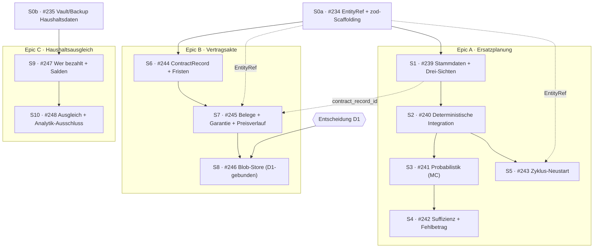

# Roadmap: Neue Produktfähigkeiten (Stand 2026-07)

> Stand: 2026-07-19. Dieses Dokument plant Arbeit; es implementiert keine
> Features. Alle Code-Anker wurden am Erstellungstag (Arbeitsbaum auf Commit
> `b9cd22e`) per `Read`/`Grep` verifiziert.

## 1. Zweck und Methode

### Zweck

Fintracker hat einen belastbaren Prognose-Kern: deterministischer Forecast,
Monte-Carlo mit P10/P50/P90, Stresskapazität, Szenarien und die
Leistbarkeitsanalyse „Frag dein Geld". Diese Roadmap beschreibt vier neue
Produktfähigkeiten, die **auf diesem Kern aufsetzen, ohne ihn umzubauen**:

1. **Lebensdauerbasierte Ersatzplanung** — bekannte Wiederbeschaffungen (Auto,
   Heizung, Laptop …) als planbare, teils probabilistische Ereignisse mit
   Rücklagenlogik.
2. **Vertrags-, Beleg- und Garantieakte** — eine nutzereigene Akte für Verträge,
   Belege und Garantien mit abgeleiteten Fristen, ohne Kündigungsautomatik.
3. **Lokaler Haushaltsausgleich** — „wer hat bezahlt, wer schuldet wem", centgenau
   und rein lokal, aufbauend auf dem bestehenden Household-Mini-Slice.
4. **Referenzmodell** — die kleinste tragfähige Konvention, um diese (und spätere)
   Entitäten typisiert und dangling-tolerant zu verknüpfen.

### Methode

Verifizierte Code-Exploration. Jede Aussage über Bestandscode ist entweder durch
einen im Text genannten Pfad + Symbolnamen belegt oder wurde beim Erstellen dieses
Dokuments selbst nachgeprüft. Der Leitgedanke aller vier Fähigkeiten:

> **Alles Neue ist Input-Transformation vor unverändertem Kern.** Es entsteht keine
> neue Forecast-, Monte-Carlo- oder Leistbarkeits-Engine.

### Abgrenzung: keine Feature-Implementierung in diesem Task

Dieses Dokument und die zugehörigen Issue-Entwürfe **liefern keinen Feature-Code**.
Sie beschreiben zukünftige Arbeit, definieren Architekturleitplanken (AD1–AD7),
schneiden die Arbeit in Slices und benennen offene Entscheidungen (D1–D7). Die
Umsetzung erfolgt später, Slice für Slice, jeweils testgetrieben.

### Bezug zu bestehenden Dokumenten (verweisen, nicht duplizieren)

- `docs/archive/claude-anweisung-und-produkt-audit-2026-06-21.md` — Produkt- und
  Anweisungs-Audit; liefert das Vokabular „ehrlich über Unsicherheit,
  Fragen-Headings, kein Feature-Sprech".
- `docs/archive/codequalitaet-audit-2026-07-02.md` — Codequalitäts-Audit; die hier
  gesetzten Architekturleitplanken respektieren dessen Befunde
  (Registry-Disziplin, keine komponenten-lokalen Aggregationen).
- `docs/archive/umsetzungsleitfaden-2026-07-02.md` — Umsetzungsleitfaden; verbindliche
  Reihenfolge „Ziel → roter Test → minimale Implementierung → Refactor".
- `docs/feature-strategy-sonderkategorien.md` — Stil- und Strukturvorbild für
  Vision, Invarianten, Gherkin-Szenarien und Work-Packages.

Diese Roadmap dupliziert deren Inhalte nicht; sie verweist auf sie.

## 2. Verifizierter Ist-Stand (mit Dateipfaden)

Alle Zeilennummern unten wurden am Erstellungstag geprüft; sie können bei späteren
Umbauten wandern — maßgeblich ist jeweils Pfad + Symbolname.

| Baustein | Verifizierter Fundort | Für uns relevant, weil |
|---|---|---|
| Deterministischer Forecast | `calculateDeterministicForecast` in `src/lib/forecast.ts:313` | Kern, der unverändert bleibt; konsumiert `ForecastInput`. |
| Rücklagen-Expansion | `expandSinkingFunds` in `src/lib/forecast.ts:226` (modul-privat) | Muster für `expandReplacementPlans`: erzeugt Transfers + Fälligkeits-Event. |
| Beitragsvorschlag | `calculateRequiredContribution` in `src/lib/forecast.ts:215` (exportiert) | Muster für den monatlichen Rückstellungsbedarf eines Ersatzplans. |
| Andock-Naht | `applyForecastOverrides` in `src/lib/forecast-data.ts:374` | Punkt, an dem transformierte Eingaben in den Kern fließen. |
| Eingabetyp | `ForecastInput`, `SinkingFund`, `PlannedForecastEvent`, `ForecastTransfer` in `src/lib/forecast-types.ts:237/218/192/105` | Zieltyp für `probabilisticEvents?` und die neuen synthetischen Ereignisse. |
| Monte-Carlo | `perturbInput` (`src/lib/forecast-montecarlo.ts:161`), `buildOccurrenceEvents` (:95), `lognormalMultiplier(normal, cv)` (:73, erwartungstreu), `mulberry32` (:37) | Seed-Strom + erwartungstreue Streuung für Ersatzfenster und Preismodi. |
| Trial-Erklärbarkeit | `TrialAssumptions` (importiert in `src/lib/forecast-montecarlo.ts:29`), `src/lib/finrisk/cell-details.ts` | Erweiterungspunkt, damit ein gesampeltes Ersatzdatum erklärbar bleibt. |
| Risiko-Post-Processing | `src/lib/finrisk/breach.ts`, `stress-capacity.ts`, `affordability.ts`, `scenario-engine.ts` | Muster für Rücklagen-Suffizienz und erwarteten Fehlbetrag über Trial-Pfade. |
| Storage-Registry | `LOCAL_FINANCE_KEYS` in `src/services/local-storage-keys.ts:10` (27 Collections) | Ein neuer Key ⇒ Backup/Verschlüsselung/Reset automatisch abgedeckt. |
| Generisches CRUD | `src/services/local-finance-store.ts` (`crypto.randomUUID`, `created_at`/`updated_at`); **`LOCAL_STORE_SCHEMA_VERSION = 2` ist ein Stub — kein Migrations-Runner** (`:17`) | Neue Felder müssen defensiv-optional sein; keine Migration verfügbar. |
| kv-Backend | `src/services/idb-kv.ts` — eine DB `ausgabentracker`, ein `kv`-Store (nur JSON-Strings), `DB_VERSION = 1` | Blobs brauchen einen eigenen Object-Store und `DB_VERSION = 2` (Issue B3). |
| Vault-Sync | `VaultPayload` in `src/services/vault-format.ts:35` — deckt **nur** `transactions/accounts/debts/claims/categories/settings` ab; Tombstone-LWW-Merge | **Haushalte/Splits fehlen** → Datenverlust-Risiko beim Sync (Issue F2). |
| Backup | `src/services/backup-service.ts` snapshottet Collections generisch über `LOCAL_FINANCE_KEYS` (`collections`-Feld, :75/:167) | Neue Collections landen automatisch im Backup; Vault jedoch nicht (s. o.). |
| Haushalte | `Household`, `HouseholdMember` (mit **ungenutztem** `share?`, `:26`), `SharedExpenseSplit` (`:36`), nur `splitEqually` (`:112`, Cent-Rest an erstes Mitglied) in `src/services/household-service.ts` | Fundament aus dem geschlossenen Mini-Slice #108; kein Zahler-Feld, keine gewichteten Splits, keine Salden. |
| Vertragserkennung | `computeContracts` in `src/lib/contract-derivation.ts:122` (Fingerprint, Zyklus- und Preisänderungs-Erkennung); `ContractDecision` in `src/services/contract-decision-service.ts:31` | **Keine persistente Vertrags-Entität; „Garantie" hat null Code-Präsenz.** |
| Fingerprint | `merchantFingerprint` in `src/lib/merchant-fingerprint.ts` | Softlink zwischen `ContractRecord` und erkannten Vertragsfamilien. |
| i18n | `src/i18n/translations.ts`, `SUPPORTED_LOCALES = ['de','en','tlh','ru']` (`:14`); `cancellationPeriodLabel: 'Kündigungsfrist (Tage)'` (`:1903`); Upsell-Copy „Gemeinsame Ausgaben fair aufteilen und ausgleichen." (`:3348`) | Feldnamen und Vokabular teils vorhanden; `pnpm check:i18n` erzwingt Vollständigkeit. |
| Kategorie-Attribute | `CategoryAttributes` in `src/types.ts:116` mit `kuendigungsfrist_tage` (`:121`) und `vertragsende` (`:122`) | Feldnamens-Vorbild für `ContractRecord`. |
| Fristen-Muster | `schufareminders` (`LOCAL_FINANCE_KEYS`, `src/services/local-storage-keys.ts:21`) | Muster für In-App-Fristenlisten (kein OS-Push). |
| Invarianten | `docs/domain-invariants.md` — **21 Invarianten**; relevant: 1 (genau einmal saldowirksam), 2 (Transfers nie Einnahme/Ausgabe), 6 (Anteilssumme exakt), 7 (Analytik ändert keine Kontostände) | Neue Ersatzplanungs-Invarianten werden Nr. 22/23. |
| OCR-Pipeline | `src/services/letter-ocr-service.ts`, `src/services/receipt-parser-service.ts` | Bestehende Pipeline für optionalen Beleg-OCR-Text (Metadaten, keine Blobs). |
| Tier-Gating | `Tier`-Union, `FEATURES`-Matrix und `hasFeatureAccess` in `src/lib/tier.ts` | Einzige Quelle für Free/Premium-Zuordnung (Entscheidung D7). |
| Feature-Slice-Vorbild | `src/features/special-categories/{domain,data,application,presentation}` | Blaupause für den Slice `src/features/replacement-planning/`. |

**Noch nicht vorhanden (wird erst durch diese Roadmap angelegt):**
`src/lib/entity-ref.ts` und das Verzeichnis `src/lib/schemas/` existieren heute
nicht (per `ls` geprüft); Issue F1 legt sie an. `docs/product/` existiert noch
nicht; dieses Dokument ist sein erster Inhalt.

## 3. Capability-Matrix

Status-Legende: **vorhanden** = im Code fertig nutzbar · **teilweise** = ein
wiederverwendbares Fragment existiert, die Fähigkeit als Ganzes fehlt · **fehlt** =
keine Code-Präsenz · **bewusst ausgeschlossen** = per Roadmap-Entscheidung nicht Teil
dieses Vorhabens. „Wiederverwendung" nennt konkrete Dateien/Symbole.

### 3.1 Ersatzplanung (Epic A · Slices S1–S5)

| Teilfunktion | Status | Wiederverwendung (konkrete Dateien) | Nötige Architekturänderung | Risiken |
|---|---|---|---|---|
| Stammdaten-Entität `ReplacementPlan` | fehlt | `SinkingFund`-Struktur (`forecast-types.ts:218`), generisches CRUD (`local-finance-store.ts`), Slice-Vorbild `src/features/special-categories/` | Neue Collection `replacementPlans` + zod-Schema (`src/lib/schemas/`) + Feature-Slice `src/features/replacement-planning/` | Kein Migrations-Runner → alle neuen Felder defensiv-optional |
| Ökonomische monatliche Nutzungskosten (Analytik) | fehlt | Aufbereitungs-Muster `src/lib/finrisk/affordability.ts` | Reine Kennzahl, **nie** in `ForecastInput` | Verwechslung mit einer Buchung würde Invariante 7 brechen |
| Monatlicher Rückstellungsbedarf | teilweise | `calculateRequiredContribution` (`forecast.ts:215`) als Muster | Adapter für Ersatzpläne (kein neuer Algorithmus) | — |
| Deterministische Forecast-Integration | teilweise | `expandSinkingFunds` (`forecast.ts:226`), Naht `applyForecastOverrides` (`forecast-data.ts:374`) | `expandReplacementPlans(plans, config)` als Spiegel; Andocken an der Naht; **zwei neue Invarianten 22/23** | Doppelzählung (Nutzungskosten vs. Transfer vs. Event) |
| Restwert als Zufluss | fehlt | `PlannedForecastEvent` (`forecast-types.ts:192`) | Separates Zufluss-Event (kein Netting, s. D5) | Netting bräche Invariante 1 (genau einmal saldowirksam) |
| Probabilistische Ersatzfenster (Monte-Carlo) | fehlt | `perturbInput` (`forecast-montecarlo.ts:161`), `buildOccurrenceEvents` (:95), `mulberry32` (:37) | Neuer Typ `probabilisticEvents?` auf `ForecastInput`; Dreiecks-Sampling des Datums pro Trial | Seed-Determinismus; Modellannahme Dreieck (s. D6) |
| Preismodi stabil/Inflation/individuell | teilweise | `lognormalMultiplier(normal, cv)` (`forecast-montecarlo.ts:73`, erwartungstreu), `VariableExpenseBaseline.volatility` | Preisdrift-Parameter je Modus; Inflations-Default (s. D2) | **Kein externer Datenabruf** |
| Rücklagen-Suffizienz + erwarteter Fehlbetrag | fehlt | Post-Processing-Muster `finrisk/breach.ts`, `stress-capacity.ts` | Neues pures Modul über vorhandene Trial-Pfade | — |
| Zyklus-Neustart nach Ersatz | fehlt | — | Persistenter Neustart (neues Ankerdatum, Rücklage zurücksetzen); optionale `EntityRef` zur realen Transaktion | — |
| Reparatur / Lebensdauerverlängerung | bewusst ausgeschlossen | — | Nur dokumentierter Erweiterungspunkt in A5 | Scope-Creep, wenn ohne eigenes Issue angefasst |

### 3.2 Vertrags-, Beleg- und Garantieakte (Epic B · Slices S6–S8)

| Teilfunktion | Status | Wiederverwendung (konkrete Dateien) | Nötige Architekturänderung | Risiken |
|---|---|---|---|---|
| Persistente Entität `ContractRecord` | fehlt | `computeContracts` (`contract-derivation.ts:122`), `merchant-fingerprint.ts`, generisches CRUD | Neue Collection `contractRecords` + zod-Schema | Abgrenzung zum schmalen Decision-Cache muss sauber bleiben |
| Kündigungsfrist / Laufzeiten (Felder) | teilweise | i18n `cancellationPeriodLabel` (`translations.ts:1903`); `CategoryAttributes.kuendigungsfrist_tage`/`vertragsende` (`types.ts:121/122`) | Feldnamen anlehnen; auf neuer Entität statt am Kategorie-Attribut | — |
| Abgeleitete Fristen (spätester Kündigungstermin, nächste Fälligkeit, Restlaufzeit) | fehlt | — | Reine Funktionen, **nie gespeichert**, immer berechnet | Monatsend-Arithmetik, automatische Verlängerung als Grenzfälle |
| In-App-Fristenliste | teilweise | `schufareminders`-Muster (`local-storage-keys.ts:21`) | Fristenliste analog; **kein OS-Push** | — |
| Softlink zur Vertragserkennung | teilweise | `ContractDecision.fingerprint` (`contract-decision-service.ts:34`), `ContractsPage.tsx` | Optionaler `fingerprint?`-Softlink auf `ContractRecord` | `ContractDecision` wird **nicht** erweitert (Invarianten 9/10/13) |
| Beleg-/Dokument-Metadaten | fehlt | OCR-Pipeline `letter-ocr-service.ts`, `receipt-parser-service.ts` | Metadaten im kv-Store (JSON-only) — **keine Blobs** in Stufe 1 | Versuch, Blobs früh einzuschleusen (gehört zu B3) |
| Garantiezeitraum + -ablauf | fehlt | Fristenlisten-Muster (s. o.) | Abgeleiteter Garantieablauf aus Kaufdatum + Garantie-Monaten | — |
| Preisverlauf | teilweise | Preisänderungs-Erkennung in `contract-derivation.ts:122` | Abgeleitet aus Transaktionen via Fingerprint + manuelle Einträge | — |
| Verschlüsselter Dokumentenspeicher (Blobs) | fehlt | `idb-kv.ts` (heute JSON-only, `DB_VERSION = 1`) | Eigener Blob-Object-Store, `DB_VERSION = 2`, AES-GCM-at-rest (entscheidungsgebunden, s. D1) | Backup-/Vault-Strategie für Blobs; Migration ohne Runner |

### 3.3 Haushaltsausgleich (Epic C · Slices S9–S10)

| Teilfunktion | Status | Wiederverwendung (konkrete Dateien) | Nötige Architekturänderung | Risiken |
|---|---|---|---|---|
| „Wer hat bezahlt" (`paid_by_member_id`) | teilweise | `SharedExpenseSplit` (`household-service.ts:36`) aus Mini-Slice #108 | Neues optionales Feld `paid_by_member_id` | Defensiv-optional (kein Migrations-Runner) |
| Gewichtete Splits | teilweise | `HouseholdMember.share?` (`household-service.ts:26`, **ungenutzt**); heute nur `splitEqually` (`:112`) | Largest-Remainder-Verteilung über `share` | Cent-Summe muss exakt bleiben (Invariante 6) |
| Salden / „wer schuldet wem" | fehlt | Aggregation ausschließlich über `src/lib/analysis-data.ts` | Pures `computeHouseholdBalances(splits, settlements)` + Min-Transfer-Greedy-Netting | Salden sind **reine Ableitung, nie gespeichert** |
| Ausgleichsbuchungen (`householdSettlements`) | fehlt | Registry-Muster `LOCAL_FINANCE_KEYS` | Neue Collection `householdSettlements` (**kein** Transaktionstyp — Barzahlung möglich) | — |
| Teilzahlungen + Status offen/teilweise/ausgeglichen | fehlt | — | Reine Ableitung aus Settlements | — |
| Analytik-Ausschluss (`linked_transaction_id`) | fehlt | `analysis-data.ts`, Forecast-Klassifikation | Verknüpfte Transaktion als interner Ausgleich aus der Konsumauswertung ausschließen (analog Invariante 2) | Doppelzählung, wenn Ausschluss unvollständig |
| Vault-/Backup-Abdeckung Haushaltsdaten | fehlt | `VaultPayload` (`vault-format.ts:35`), Backup-`collections` (`backup-service.ts`) | Payload um `households`/`householdMembers`/`sharedExpenseSplits` (+ `householdSettlements`) erweitern (Issue F2) | **Datenverlust beim Sync** — harter Blocker vor C1 (s. D4) |
| Multi-Device / Cloud / E2E / Rollen | bewusst ausgeschlossen | Verweis #37/#38 | Nur als spätere, separat zu begründende Architekturinitiative dokumentieren | — |

### 3.4 Referenzmodell (Fundament F1)

| Teilfunktion | Status | Wiederverwendung (konkrete Dateien) | Nötige Architekturänderung | Risiken |
|---|---|---|---|---|
| `EntityRef`-Typ + geschlossene Union | fehlt | Bereits repo-weit übliche typisierte FK-Felder | Neue Datei `src/lib/entity-ref.ts` (`EntityRef { kind; id }`, Union `'transaction' \| 'contract_record' \| 'replacement_plan'`) | — |
| Per-Kind-Resolver, dangling-tolerant | fehlt | — | Resolver je Kind; gelöschtes Ziel ⇒ „nicht mehr vorhanden"; Lösch-UI zeigt verknüpfte Referenzen | Kein Kaskadenzwang — bewusst |
| zod-Schema-Scaffolding | fehlt | `docs/coding-guide.md` §6 (zod an Datengrenzen) | `src/lib/schemas/` für `ReplacementPlan`, `ContractRecord`, `HouseholdSettlement` | — |
| Generische Link-Tabelle | bewusst ausgeschlossen | — | — | O(n)-kv-Scans, neue Backup-/Tombstone-Fläche, null Konsumenten |
| Zukunftsmodule (Car/Wealth/Meal/…) | fehlt (existieren nicht) | — | Ergänzen später **nur** Kind + Resolver, keine Migration | Referenzmodell darf **nicht** von ihnen abhängen |

## 4. Architekturgrenzen und Entscheidungen (AD1–AD7)

Die sieben Architektur-Entscheidungen sind die verbindliche Grundlage aller Issues.
Sie sind hier in Prosa mit den verifizierten Code-Ankern ausformuliert.

### AD1 — Ersatzplanung hat eine eigene Datenheimat

Ersatzpläne wohnen in einer neuen Collection `replacementPlans`
(Registry-Key-Vorschlag `fintracker_replacement_plans_v1` in `LOCAL_FINANCE_KEYS`,
`src/services/local-storage-keys.ts:10`), validiert durch ein zod-Schema in
`src/lib/schemas/`, präsentiert im Feature-Slice
`src/features/replacement-planning/{domain,data,application,presentation}` nach dem
Vorbild `src/features/special-categories/`. Ein Ersatzplan gehört **nicht** in
`ForecastOverrides` — er ist eigenständige Nutzerdomäne, keine Prognose-Korrektur.
Weil ein neuer Registry-Key automatisch von Backup, Verschlüsselung und Reset erfasst
wird (`src/services/backup-service.ts`), ist die Datenheimat mit dem Key bereits
abgesichert.

### AD2 — SinkingFund ist Vorbild, nicht Vaterklasse

`ReplacementPlan` und `SinkingFund` (`src/lib/forecast-types.ts:218`) sind parallele
Konzepte mit **geteilter Expansions-Mechanik, aber getrenntem Datenmodell**. Die
neue reine Adapter-Funktion `expandReplacementPlans(plans, config)` spiegelt
`expandSinkingFunds` (`src/lib/forecast.ts:226`) und erzeugt je Plan:

- einen monatlichen `ForecastTransfer` (Rücklagenbewegung, kontoneutral),
- einen `PlannedForecastEvent` (der Abfluss am Ersatztermin),
- **plus** — falls ein Restwert existiert — einen **separaten Zufluss-Event** (kein
  Netting; siehe Invariante-Argument in AD3 und Entscheidung D5).

Der monatliche Beitragsvorschlag folgt dem Muster von
`calculateRequiredContribution` (`src/lib/forecast.ts:215`). Angedockt wird an der
Naht `applyForecastOverrides` (`src/lib/forecast-data.ts:374`) — die Engine
(`calculateDeterministicForecast`, `src/lib/forecast.ts:313`) bleibt **unangetastet**.

### AD3 — Drei-Sichten-Trennung (Invarianten-kritisch)

Ein Ersatzvorhaben erscheint in **drei** streng getrennten Sichten. Ihre Trennung ist
kein Darstellungsdetail, sondern eine Integritätsgarantie:

| Sicht | Wesen | Bindet an bestehende Invariante | Konsequenz |
|---|---|---|---|
| (a) Ökonomische monatliche Nutzungskosten | reine Analytik | **Invariante 7** (Analytik ändert keine Kontostände) | Geht **nie** in `ForecastInput` — analog zur Behandlung anderer reiner Kennzahlen. |
| (b) Rücklagenbewegung | Transfer | **Invariante 2** (Transfers sind nie Einnahme/Ausgabe) | Zählt weder als Einnahme noch als Ausgabe. |
| (c) Tatsächlicher Ersatz | saldowirksamer `PlannedForecastEvent` | **Invariante 1** (genau einmal saldowirksam) | Der einzige Cashflow-wirksame Posten des Vorhabens. |

Damit diese Trennung testbar erzwungen ist, ergänzt **Issue A2 zwei neue nummerierte
Invarianten** in `docs/domain-invariants.md` (heute 21 Invarianten → neue Nr. **22**
und **23**) samt `[INTEGRITY]`-Tests. Die exakte Wortlaut-Festlegung ist Aufgabe von
A2; inhaltlich decken sie ab: (22) Nutzungskosten der Ersatzplanung sind reine
Analytik und erzeugen nie Cashflow; (23) ein Ersatzvorhaben ist über Transfer,
Ersatz-Event und Restwert-Zufluss zusammengenommen genau einmal saldowirksam — keine
Doppelzählung.

### AD4 — Probabilistik ist Sampling, keine neue Engine

Ein neuer Typ beschreibt das Ersatzfenster (früh / wahrscheinlich / spät) samt
Preisparametern und hängt als optionales Feld `probabilisticEvents?` an `ForecastInput`
(`src/lib/forecast-types.ts:237`). Der deterministische Kern konsumiert die
**Erwartungswert-Projektion** (P50-konsistent). Pro Monte-Carlo-Trial sampelt
`perturbInput` (`src/lib/forecast-montecarlo.ts:161`):

- das **Ersatzdatum aus einer Dreiecksverteilung** über das Fenster (aus dem
  vorhandenen `mulberry32`-Seed-Strom, `:37`),
- den **Preis** über den vorhandenen erwartungstreuen `lognormalMultiplier(normal, cv)`
  (`:73`), Muster wie `buildOccurrenceEvents` (`:95`).

`TrialAssumptions` (`src/lib/forecast-montecarlo.ts:29`, ausgewertet in
`src/lib/finrisk/cell-details.ts`) wird erweitert, damit ein gesampeltes Ersatzdatum
erklärbar bleibt. Rücklagen-Suffizienz und erwarteter Fehlbetrag sind
**Post-Processing über die vorhandenen Trial-Pfade** (Muster `src/lib/finrisk/breach.ts`,
`stress-capacity.ts`) — kein Eingriff in die Sampling-Schleife.

**Ausdrücklich außerhalb:** Weibull-/Hazard-Kurven, Korrelation zwischen Ausfällen,
Reparaturen im Monte-Carlo und jede neue Engine (siehe D6).

### AD5 — Vertragsakte ist nutzereigen, nicht der Decision-Cache

Die neue Entität `ContractRecord` (Registry-Key-Vorschlag
`fintracker_contract_records_v1`) trägt einen optionalen `fingerprint?`-**Softlink** zur
bestehenden Vertragserkennung (`src/lib/merchant-fingerprint.ts`,
`computeContracts` in `src/lib/contract-derivation.ts:122`). Der schmale
Decision-Cache `ContractDecision` (`src/services/contract-decision-service.ts:31`)
wird **nicht** erweitert — er ist an die Invarianten 9/10/13 gebunden, während die
Akte nutzereigen ist und ohne jede Transaktion existieren kann (z. B. die Garantie
eines Barkaufs).

Abgeleitete Fristen (spätester Kündigungstermin, nächste Fälligkeit, Restlaufzeit)
werden **nie gespeichert, immer berechnet**. Erinnerungen sind eine In-App-Fristenliste
nach dem `schufareminders`-Muster (`src/services/local-storage-keys.ts:21`) —
**kein OS-Push**. Feldnamen lehnen sich an `CategoryAttributes`
(`kuendigungsfrist_tage`, `vertragsende` in `src/types.ts:121/122`) an. Belege sind
**gestuft**: Stufe 1 nur Metadaten (der kv-Store bleibt JSON-only); Stufe 2 (echter
Blob-Store) ist das eigene, entscheidungsgebundene Issue B3.

Abgrenzung: Die Vertragsakte ersetzt **nicht** die Erkennung und ist **nicht** die
Forderungsakte (#46, „Schulden-Briefe" — anderes Konzept). Sie enthält keinen
Kündigungsservice.

### AD6 — Haushaltsausgleich rein aus Ableitungen

Ein neues Feld `paid_by_member_id` auf `SharedExpenseSplit`
(`src/services/household-service.ts:36`) hält fest, wer real gezahlt hat. Gewichtete
Splits nutzen das bislang **ungenutzte** `HouseholdMember.share`
(`src/services/household-service.ts:26`) über eine Largest-Remainder-Verteilung
(centgenau, analog **Invariante 6**). Salden und Status (offen / teilweise /
ausgeglichen) sind **reine Ableitungen, nie gespeichert**; „wer schuldet wem" ergibt
sich aus paarweisem Netting (Min-Transfer-Greedy). Aggregation läuft ausschließlich
über `src/lib/analysis-data.ts`.

Ausgleiche wohnen in einer **neuen Collection `householdSettlements`**
(Registry-Key-Vorschlag `fintracker_household_settlements_v1`) — **kein**
Transaktionstyp, da Barzahlungen möglich sind:
`{id, household_id, from_member_id, to_member_id, amount_cents, date, note?, linked_transaction_id?}`.
Ist `linked_transaction_id` gesetzt, wird die reale Transaktion als interner Ausgleich
klassifiziert und aus der Konsumauswertung ausgeschlossen (analog **Invariante 2**).
„Privat vs. gemeinsam" ist keine neue Flag, sondern die Existenz bzw. das Fehlen eines
Splits.

Multi-Device, Cloud, E2E-Verschlüsselung und Rollen über echte Benutzerkonten sind
**nur** als spätere, separat zu begründende Architekturinitiative dokumentiert
(Verweis auf die Vault-Sync-Issues #37/#38).

### AD7 — Referenzmodell: kleinste tragfähige Erweiterung + Trackerverse-Vorwärtskompatibilität

Wo das Ziel statisch ist, bleiben **typisierte FK-Felder** die Regel (wie heute
überall). Ergänzt wird eine dokumentierte `EntityRef`-Konvention in der neuen Datei
`src/lib/entity-ref.ts`:

```
interface EntityRef { kind: EntityKind; id: string }
// geschlossene Union initial:
type EntityKind = 'transaction' | 'contract_record' | 'replacement_plan'
```

mit per-Kind-Resolvern und **Dangling-Toleranz**: Ein gelöschtes Ziel wird als „nicht
mehr vorhanden" angezeigt, es gibt keinen Kaskadenzwang, und die Lösch-UI zeigt
verknüpfte Referenzen. Referenzen kopieren **nie** Daten — die Anzeige läuft immer über
den Resolver.

**Kein generisches Link-Table.** Es brächte O(n)-kv-Scans, neue Backup- und
Tombstone-Fläche und hätte heute null Konsumenten.

**Trackerverse-Vorwärtskompatibilität (verbindlich):** Zukünftige Module — Car,
Wealth, Meal, Fit, Sleep, Mood — **existieren im Repository nicht** (per Verzeichnis-
und Symbolsuche bestätigt; heute vorhanden: `dashboard`, `finance-city`, `shared`,
`special-categories`, `transactions`). Das Referenzmodell darf **nicht** von ihnen
abhängen. Sie ergänzen später lediglich einen neuen `EntityKind` plus Resolver —
**keine Migration, kein Umbau** der bestehenden Referenzen. Diese Entkopplung ist der
eigentliche Zweck der geschlossenen Union: Sie ist erweiterbar, ohne rückwirkend zu
brechen (vgl. `docs/coding-guide.md` §13 Trackerverse-Modularität).

## 5. Priorisierte Roadmap

### Slice-Sequenz S0a–S10

Größen aus der Skala **XS–XL**. **Keine Zeitschätzungen** — die Reihenfolge ergibt
sich aus Abhängigkeiten, nicht aus Aufwand.

| Slice | Issue | Titel (Kurz) | Größe | Hängt ab von |
|---|---|---|---|---|
| **S0a** | [#234](https://github.com/DBocken/Fintracker/issues/234) | Fundament: `EntityRef`-Konvention + zod-Schema-Grundlage | S | — |
| **S0b** | [#235](https://github.com/DBocken/Fintracker/issues/235) | Fundament: Vault-/Backup-Abdeckung für Haushaltsdaten | S | — |
| **S1** | [#239](https://github.com/DBocken/Fintracker/issues/239) | Ersatzplanung: Stammdaten, Fixtermin, Drei-Sichten-Anzeige | M | S0a |
| **S2** | [#240](https://github.com/DBocken/Fintracker/issues/240) | Ersatzplanung: deterministische Forecast-Integration | M | S1 |
| **S3** | [#241](https://github.com/DBocken/Fintracker/issues/241) | Ersatzplanung: probabilistische Fenster + Preismodi (MC) | L | S2 |
| **S4** | [#242](https://github.com/DBocken/Fintracker/issues/242) | Ersatzplanung: Rücklagen-Suffizienz + erwarteter Fehlbetrag | M | S3 |
| **S5** | [#243](https://github.com/DBocken/Fintracker/issues/243) | Ersatzplanung: Zyklus-Neustart + Reparatur-Erweiterungspunkt | S | S2 |
| **S6** | [#244](https://github.com/DBocken/Fintracker/issues/244) | Vertragsakte: `ContractRecord` + Fristen | M | S0a |
| **S7** | [#245](https://github.com/DBocken/Fintracker/issues/245) | Vertragsakte: Beleg-Metadaten, Garantie, Preisverlauf, Verknüpfungen | S | S6 |
| **S8** | [#246](https://github.com/DBocken/Fintracker/issues/246) | Vertragsakte: verschlüsselter Blob-Store (entscheidungsgebunden) | L | S7, Entscheidung D1 |
| **S9** | [#247](https://github.com/DBocken/Fintracker/issues/247) | Haushaltsausgleich: Wer bezahlt, Soll-/Ist-Anteile, Salden | M | S0b |
| **S10** | [#248](https://github.com/DBocken/Fintracker/issues/248) | Haushaltsausgleich: Ausgleichsbuchungen, Teilzahlungen, Analytik-Ausschluss | M | S9 |

Empfohlene Startpunkte sind die beiden Fundament-Slices S0a und S1 parallel: S0a
(`EntityRef` + Schema-Scaffolding) entlastet A/B, S0b entriegelt C — sie blockieren
sich gegenseitig nicht. Die drei Epics laufen danach weitgehend unabhängig.

### Abhängigkeitsgraph



Durchgezogene Kanten sind harte Reihenfolge-Abhängigkeiten; gestrichelte Kanten sind
weiche Querbezüge über `EntityRef`/optionale Felder, die keine Daten kopieren und die
Slice-Reihenfolge nicht erzwingen.

## 6. Issue-Übersicht

Alle 15 Issues wurden am 2026-07-19 angelegt und sind unten verlinkt.
Bestehende Issues sind mit echter Nummer referenziert.

| Ref | Titel | Labels | Größe | Abhängigkeiten | Slice |
|---|---|---|---|---|---|
| [#234](https://github.com/DBocken/Fintracker/issues/234) | Fundament: EntityRef-Konvention und zod-Schema-Grundlage für neue Module | `roadmap`, `quality` | S | — | S0a |
| [#235](https://github.com/DBocken/Fintracker/issues/235) | Fundament: Vault- und Backup-Abdeckung für Haushaltsdaten | `roadmap`, `security`, `privacy` | S | — | S0b |
| [#236](https://github.com/DBocken/Fintracker/issues/236) | [Epic] Lebensdauerbasierte Ersatzplanung | `epic`, `roadmap`, `enhancement`, `ersatzplanung` | — | [#234](https://github.com/DBocken/Fintracker/issues/234) | — |
| [#239](https://github.com/DBocken/Fintracker/issues/239) | Ersatzplanung: Stammdaten, Fixtermin-Planung und Drei-Sichten-Anzeige | `roadmap`, `enhancement`, `ersatzplanung` | M | [#234](https://github.com/DBocken/Fintracker/issues/234) | S1 |
| [#240](https://github.com/DBocken/Fintracker/issues/240) | Ersatzplanung: deterministische Forecast-Integration ohne Doppelzählung | `roadmap`, `enhancement`, `ersatzplanung` | M | [#239](https://github.com/DBocken/Fintracker/issues/239) | S2 |
| [#241](https://github.com/DBocken/Fintracker/issues/241) | Ersatzplanung: probabilistische Ersatzfenster und Preismodi im Monte-Carlo | `roadmap`, `enhancement`, `ersatzplanung` | L | [#240](https://github.com/DBocken/Fintracker/issues/240) | S3 |
| [#242](https://github.com/DBocken/Fintracker/issues/242) | Ersatzplanung: Rücklagen-Suffizienz und erwarteter Fehlbetrag über alle Ersatzereignisse | `roadmap`, `enhancement`, `ersatzplanung` | M | [#241](https://github.com/DBocken/Fintracker/issues/241) | S4 |
| [#243](https://github.com/DBocken/Fintracker/issues/243) | Ersatzplanung: Zyklus-Neustart nach Ersatz und Reparatur-Erweiterungspunkt | `roadmap`, `enhancement`, `ersatzplanung` | S | [#240](https://github.com/DBocken/Fintracker/issues/240) | S5 |
| [#237](https://github.com/DBocken/Fintracker/issues/237) | [Epic] Vertrags-, Beleg- und Garantieakte | `epic`, `roadmap`, `enhancement`, `vertragsakte` | — | [#234](https://github.com/DBocken/Fintracker/issues/234) | — |
| [#244](https://github.com/DBocken/Fintracker/issues/244) | Vertragsakte: ContractRecord mit Laufzeiten, Kündigungsfristen und abgeleiteten Fälligkeiten | `roadmap`, `enhancement`, `vertragsakte` | M | [#234](https://github.com/DBocken/Fintracker/issues/234) | S6 |
| [#245](https://github.com/DBocken/Fintracker/issues/245) | Vertragsakte: Beleg-Metadaten, Garantiezeitraum, Preisverlauf und Verknüpfungen | `roadmap`, `enhancement`, `vertragsakte` | S | [#244](https://github.com/DBocken/Fintracker/issues/244) | S7 |
| [#246](https://github.com/DBocken/Fintracker/issues/246) | Vertragsakte: verschlüsselter Dokumentenspeicher (Blob-Store, entscheidungsgebunden) | `roadmap`, `enhancement`, `vertragsakte`, `security`, `privacy` | L | [#245](https://github.com/DBocken/Fintracker/issues/245), D1 | S8 |
| [#238](https://github.com/DBocken/Fintracker/issues/238) | [Epic] Lokaler Haushaltsausgleich | `epic`, `roadmap`, `enhancement`, `privacy`, `haushalt` | — | [#235](https://github.com/DBocken/Fintracker/issues/235) | — |
| [#247](https://github.com/DBocken/Fintracker/issues/247) | Haushaltsausgleich: Wer hat bezahlt, Soll-/Ist-Anteile und centgenaue Salden | `roadmap`, `enhancement`, `haushalt` | M | [#235](https://github.com/DBocken/Fintracker/issues/235) | S9 |
| [#248](https://github.com/DBocken/Fintracker/issues/248) | Haushaltsausgleich: Ausgleichsbuchungen, Teilzahlungen und Analytik-Ausschluss | `roadmap`, `enhancement`, `haushalt`, `privacy` | M | [#247](https://github.com/DBocken/Fintracker/issues/247) | S10 |

## 7. Bewusste Ausschlüsse

Diese Punkte sind **kein** Bestandteil dieser Roadmap. Sie sind aufgeführt, damit
niemand sie versehentlich in einen Slice zieht.

- **Android Notification Listener** — würde das local-first-Modell verlassen und
  ein systemweites Abhorchen von Benachrichtigungen einführen.
- **Überwachung von Bank-/Wallet-Benachrichtigungen** — dieselbe Grenze; Daten
  gelangen ausschließlich über Import und Bank-Sync in die App, nicht über
  Notification-Scraping.
- **Generischer KI-Chatbot** — kein Produktziel; die App bleibt deterministisch und
  in ihren Aussagen erklärbar.
- **Kreditkarten-Benefit-Datenbank** — externe Pflegelast ohne local-first-Nutzen und
  ohne Bezug zu den geplanten Fähigkeiten.
- **Automatischer Kündigungsservice** — B1 liefert Fristen und Erinnerungen, versendet
  aber keine Kündigungen; die App handelt nicht stellvertretend nach außen.
- **Vermögensdaten im Cashflow-Modul duplizieren** — das Referenzmodell verlinkt
  (AD7), es kopiert nie Daten in ein zweites Modul.
- **Echter verschlüsselter Mehrbenutzer-Sync ohne separates E2E-Konzept** — nur als
  spätere Architekturinitiative dokumentiert (Verweis #37/#38), nicht in Epic C.
- **Neue Leistbarkeits- oder Monte-Carlo-Engine** — alles Neue ist
  Input-Transformation vor unverändertem Kern; die Engines bleiben, wie sie sind.

Ebenso werden **bereits vorhandene Fähigkeiten nicht neu geplant**: Forecast,
Monte-Carlo, P10/50/90, Stresskapazität, Szenarien, „Frag dein Geld",
Vertragserkennung, Snowball/Avalanche, Sinking Funds, CSV, Bank-Sync, OCR,
Auto-Kategorisierung, Haushalte/Splits, Anlässe sowie Einkommensanalyse/Steuerreserve.

## 8. Offene Entscheidungen (D1–D7)

Jede Entscheidung nennt die Frage, die relevanten Anker und eine begründete
**Empfehlung**. Die Empfehlung ist ein Vorschlag zur Diskussion, keine bereits
getroffene Festlegung.

### D1 — Blob-Speicher für Belege (bindet Issue B3)

**Frage:** Wie werden Beleg-Dokumente gespeichert, und was folgt daraus für Backup,
Größenlimit und DB-Migration? Der kv-Store hält heute nur JSON-Strings
(`src/services/idb-kv.ts`, `DB_VERSION = 1`), und einen Migrations-Runner gibt es
nicht (`LOCAL_STORE_SCHEMA_VERSION = 2` ist ein Stub, `src/services/local-finance-store.ts:17`).

**Empfehlung:** Metadaten-first. B2 speichert ausschließlich Beleg-**Metadaten** im
bestehenden JSON-kv-Store; der eigentliche Blob-Store ist B3 und bleibt hinter dieser
Entscheidung gegated. Für B3:
- **Migration:** additive `DB_VERSION = 2` mit einem **neuen** Object-Store für Blobs
  — kein Datenumzug bestehender Records, daher auch ohne Runner sicher.
- **Verschlüsselung:** AES-GCM-at-rest, sobald die Verschlüsselung aktiv ist.
- **Größenlimit:** harte Quote pro Dokument, Vorschlag **10 MB**.
- **Backup/Vault:** Blobs standardmäßig **nicht** ins Vault-Payload (Größe, Sync-Kosten);
  Aufnahme ins lokale Backup optional und opt-in, mit expliziter Klartext-Freiheits-Prüfung
  (Invariante 16).

### D2 — Inflations-Default für Preismodi

**Frage:** Welcher Standardwert gilt für den Preismodus „allgemeine Inflation", und wie
wird er konfiguriert?

**Empfehlung:** Default **2 % p. a.**, als **lokale** Einstellung konfigurierbar und
**pro Ersatzplan** überschreibbar (individuelle Rate als eigener Modus). **Kein
externer Datenabruf** — der Wert ist eine transparente Nutzerannahme, keine
Live-Marktzahl.

### D3 — Ausgleich als eigenes Ledger vs. realer Banktransfer

**Frage:** Ist ein Haushaltsausgleich eine eigene Buchung oder eine reale Transaktion?

**Empfehlung:** Eigenes Ledger. `householdSettlements` ist **kein** Transaktionstyp
(Barzahlungen müssen möglich sein, AD6). Optional verweist `linked_transaction_id` auf
eine reale Transaktion; diese wird dann als interner Ausgleich klassifiziert und aus
der Konsumauswertung ausgeschlossen (`src/lib/analysis-data.ts`, analog Invariante 2).
So bleibt „ich habe per Überweisung ausgeglichen" abbildbar, ohne die
Ausgabenstatistik zu verfälschen.

### D4 — Vault-Lücke bei Haushaltsdaten

**Frage:** Muss die Vault-/Backup-Abdeckung vor dem Haushaltsausgleich geschlossen
werden? Der `VaultPayload` (`src/services/vault-format.ts:35`) deckt Haushalte, Splits
und Ausgleiche heute **nicht** ab.

**Empfehlung:** Ja — **F2 ist ein harter Blocker vor C1.** Ohne die Payload-Erweiterung
gingen `households`/`householdMembers`/`sharedExpenseSplits`/`householdSettlements` beim
Vault-Sync verloren. F2 muss vor jedem Merge von C1 stehen.

### D5 — Restwert als separater Zufluss vs. Netting

**Frage:** Wird ein Restwert (z. B. Verkaufserlös des Altgeräts) gegen den Ersatzpreis
verrechnet oder separat gebucht?

**Empfehlung:** **Separat** als eigener Zufluss-Event. Netting würde den saldowirksamen
Ersatz-Event verändern und die Nachvollziehbarkeit von Invariante 1 (genau einmal
saldowirksam) untergraben. Ein getrennter Zufluss-Event ist invariantensauber, einzeln
prüfbar und in den `[INTEGRITY]`-Tests von A2 klar von Transfer und Abfluss trennbar.

### D6 — Modellannahmen des Monte-Carlo

**Frage:** Welche Verteilungs- und Unabhängigkeitsannahmen gelten für die
probabilistischen Ersatzfenster?

**Empfehlung:** **Dreiecksverteilung** über das Fenster (früh/wahrscheinlich/spät) und
**Unabhängigkeit** der Ersatzereignisse — beides als **dokumentierte, bewusste Annahme**
gekennzeichnet, nicht als physikalische Wahrheit. Weibull-/Hazard-Kurven und Korrelation
zwischen Ausfällen sind ausdrücklich außerhalb (AD4). Diese Ehrlichkeit über die
Modellgrenze gehört sichtbar in die UI-Erklärung und in die Testtitel.

### D7 — Tier-Gating (Free/Premium)

**Frage:** Welche der neuen Fähigkeiten sind Free, welche Premium?

**Empfehlung:** Die Zuordnung ist eine **Produktentscheidung** und wird hier nicht
vorweggenommen. Technisch ist sie ohne Umbau abbildbar: über die `FEATURES`-Matrix und
`hasFeatureAccess` in `src/lib/tier.ts` (die einzige Quelle der Gating-Logik). Für den
Haushaltsausgleich existiert bereits Upsell-Copy („Gemeinsame Ausgaben fair aufteilen
und ausgleichen.", `src/i18n/translations.ts:3348`), was eine Premium-Einstufung
nahelegt — die endgültige Zuordnung bleibt aber offen und mit den Monetarisierungs-Issues
#52/#53 abzustimmen.

---

*Querverweise auf bestehende Issues: #37/#38 (Vault-Sync Desktop/Android), #46
(Forderungsakten — abgegrenzt in AD5), #52/#53 (Monetarisierung/Gating), #54
(Design-System / Fragen-Headings), #108 (Household-Mini-Slice, geschlossen), #175
(Audit-Nacharbeiten).*
